# flaws.cloud — All 6 Levels of Cloud Vulnerabilities Walkthrough

| Field | Value |
|---|---|
| Date | 21-05--2026 |
| Platform | flaws.cloud by Scott Piper |
| Category | Cloud Security — AWS Misconfiguration |
| Difficulty | Medium |
| ATT&CK TTPs | T1530 · T1552.005 · T1078.004 · T1213 · T1619 |
| Tools Used | AWS CLI, curl, git, host, nslookup |
| Time Spent | 48 hrs+ |

---

## Executive Summary

flaws.cloud is a purposely vulnerable AWS environment built by Scott Piper
to teach common cloud security mistakes. Across 6 levels it demonstrates
how excessive S3 permissions, leaked credentials inside Git history,
publicly accessible EC2 snapshots, exposed Instance Metadata Service (IMDS)
endpoints, and over-permissive IAM policies can be chained together by an
attacker to progressively escalate access across an entire AWS account.
The overarching theme is the same across every level: resources that should
be private are reachable because of misconfigured permissions, and
credentials that should never leave a controlled environment end up exposed
in storage, metadata services, and version control history.

---

## Level 1: Public S3 Bucket

**Vulnerability:** S3 bucket configured to allow `s3:ListBucket` for
everyone including unauthenticated users. Anyone on the internet could
list all objects inside without having any credentials.

**What I did:**

I started with DNS enumeration to determine how flaws.cloud is hosted.

```bash
host flaws.cloud
```

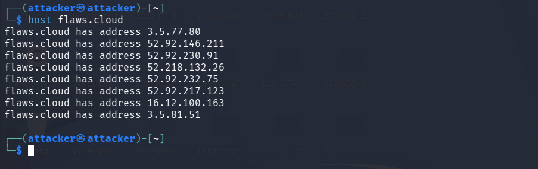

This returned eight IP addresses. I ran a reverse lookup on one of them
to confirm the hosting infrastructure.

```bash
nslookup 52.92.146.211
```

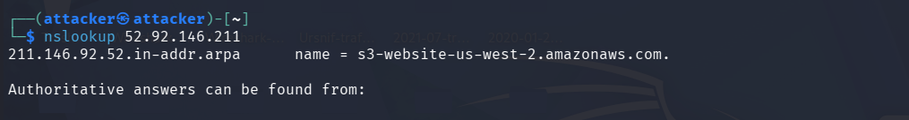

The reverse lookup returned `s3-website-us-west-2.amazonaws.com`,
confirming that `flaws.cloud` is hosted as an S3 static website in the
`us-west-2` region. Since S3 static website buckets use the domain name
as the bucket name, the bucket is simply named `flaws.cloud`. I then
listed its contents without any credentials:

```bash
aws s3 ls s3://flaws.cloud/ --no-sign-request --region us-west-2
```

The bucket listing returned its full contents including a file named
`secret-dd02c7c.html`. Navigating to
`http://flaws.cloud/secret-dd02c7c.html` revealed the URL for Level 2.

**Why it worked:** The bucket policy granted `s3:ListBucket` to
`Principal: *` meaning the entire internet. `--no-sign-request` tells
the AWS CLI to send the request without any credentials, simulating an
anonymous user. Any anonymous user with the bucket name can list every
object inside it.

**The fix:** Remove the `s3:ListBucket` permission from the public
policy. If the bucket hosts a public website, grant only `s3:GetObject`
so visitors can read files they already know the path to, but cannot
enumerate what else exists in the bucket.

---

## Level 2: S3 Open to Any Authenticated AWS User

**Vulnerability:** S3 bucket permissions set to allow access for
`AuthenticatedUsers` a predefined AWS group that means any person
holding any AWS account anywhere in the world, not just users within the
bucket owner's own account.

**What I did:**

This level required a personal AWS account to demonstrate the
vulnerability. The command to exploit it is:

```bash
aws s3 --profile YOUR_ACCOUNT ls \
  s3://level2-c8b217a33fcf1f839f6f1f73a00a9ae7.flaws.cloud
```

With valid credentials from any AWS account configured under
`YOUR_ACCOUNT`, the bucket listing returns its full contents including
`secret-e4443fc.html`, the path to Level 3. No relationship to the
bucket owner's account is required. Simply having signed credentials
from any AWS account is sufficient.

**Why it works:** The `AuthenticatedUsers` group in AWS ACL terminology
does not mean authenticated to your account. It means authenticated to
AWS i.e. anyone holding an active AWS account globally. Many
developers make this mistake believing they are restricting access to
their own team. The result is a bucket that is effectively public to
every AWS customer at all.

**The fix:** Never grant permissions to the `AuthenticatedUsers`
predefined group. Use explicit IAM user or role ARNs to grant access
only to known, specific identities within your own account or a trusted
partner account.

---

## Level 3: AWS Access Keys Leaked in Git History

**Vulnerability:** The S3 bucket was configured with public list access
and contained a `.git` directory. A developer must have accidentally committed
AWS access keys in an early commit, then tried to remove them in a
subsequent commit but Git retains the full commit history, making the
keys permanently recoverable.

**What I did:**

I listed the Level 3 bucket and found it contained a `.git` directory
alongside the normal website files. I synced the entire bucket to a
local directory I created called `awshack` to work with the Git repository:

```bash
aws s3 sync s3://level3-9afd3927f195e10225021a578e6f78df.flaws.cloud/ \
  . --no-sign-request --region us-west-2
```

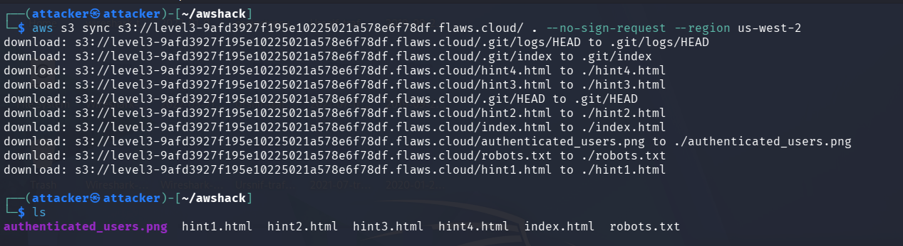

The download confirmed the `.git` folder was present. I ran `git log`
to inspect the commit history:

```bash
git log
```

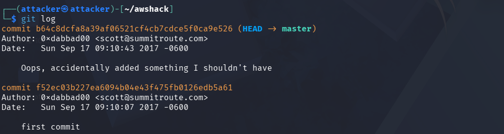

Two commits were present. The most recent carried the message *"Oops,
accidentally added something I shouldn't have"*, a clear signal that
something sensitive was committed and then removed. I checked out the
older commit first to see what it contained before the removal:

```bash
git checkout b64c8dcfa8a39af06521cf4cb7cdce5f0ca9e526
```

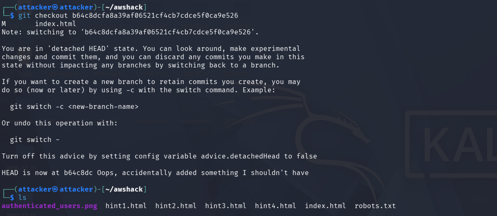

No new files appeared. I then checked out the very first commit:

```bash
git checkout f52ec03b227ea6094b04e43f475fb0126edb5a61
```

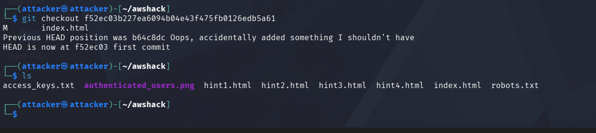

Listing the files now showed `access_keys.txt`, a file that had been
added in the first commit and removed in the second, but which Git
preserved in full. Reading it:

```bash
cat access_keys.txt
```

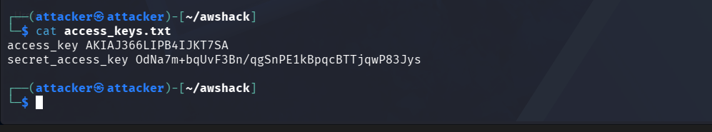

The file contained a plaintext AWS Access Key ID and Secret Access Key.
I configured a new AWS CLI profile with these credentials:

```bash
aws configure --profile user1
```

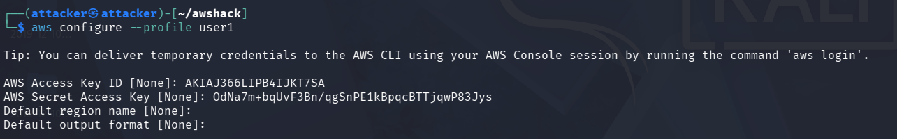

I verified who the keys belonged to:

```bash
aws --profile user1 sts get-caller-identity
```

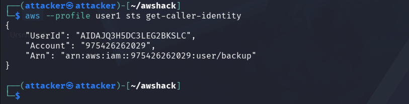

The keys belonged to an IAM user named `backup` in account
`975426262029`. With these credentials I could now list all S3 buckets
in the account including the Level 4 and Level 5 bucket names which
gave me the URL to advance.

**Why it works:** Git is a complete audit trail. Deleting a file in a
commit does not delete it from history rather it remains fully recoverable
by anyone with access to the repository or, in this case, the `.git`
directory itself. Exposing the `.git` folder inside a public S3 bucket
hands an attacker both the history and the tools to extract it.

**The fix:** Never commit credentials to version control under any
circumstances. Use `.gitignore` to exclude credential files before the
first commit. If keys are ever accidentally committed, treat them as
compromised immediately, revoke and rotate them regardless of whether
you believe the repository is private. Use AWS Secrets Manager or
environment variables for credential storage. Never expose a `.git`
directory in a public-facing storage bucket.

---

## Level 4: Public EC2 EBS Snapshot

**Vulnerability:** An EC2 EBS (Elastic Block Store) snapshot, a backup
of an EC2 instance's hard disk was made public. Any AWS account can
create a volume from a public snapshot and mount it to their own EC2
instance, giving them read access to everything that was on the original
disk at the time of the backup, including credentials, configuration
files, and application data.

**What I did:**

Using the `backup` user credentials from Level 3, I enumerated EC2
snapshots owned by the account. The account ID `975426262029` was
visible in the `sts get-caller-identity` output from the previous level.

```bash
aws --profile user1 ec2 describe-snapshots \
  --owner-id 975426262029 --region us-west-2
```

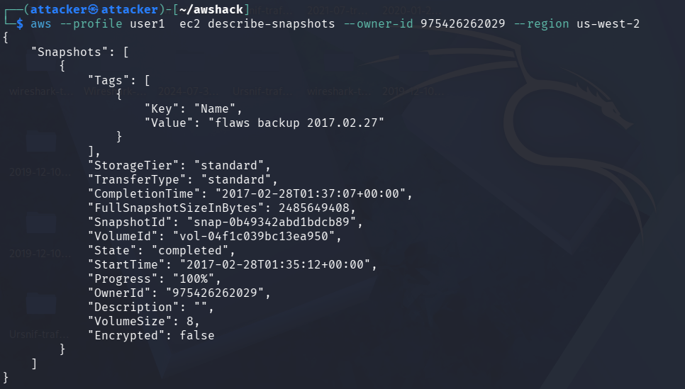

This returned one snapshot: `snap-0b49342abd1bdcb89`, tagged *"flaws
backup 2017.02.27"*, 8GB in size, with `"Encrypted": false`. The
`Encrypted: false` field confirms the snapshot contents would be fully
readable if mounted. The full exploitation path requires creating a
volume from this snapshot in your own AWS account and mounting it to a
temporary EC2 instance to read the filesystem. This step that requires
an active AWS account with EC2 permissions.

**Why it works:** AWS snapshots have their own visibility setting
independent of the account that owns them. Setting a snapshot to
`public` means any AWS account can call `ec2 create-volume` from it.
An unencrypted public snapshot of an EC2 instance is equivalent to
handing an attacker a copy of the server's hard drive.

**The fix:** Never make EBS snapshots public. If a snapshot must be
shared, share it explicitly with specific AWS account IDs using
`--create-volume-permission`. Always encrypt EBS volumes and their
snapshots using AWS KMS so that even if a snapshot were accidentally
made public, its contents remain unreadable without the KMS key.

---

## Level 5: EC2 Instance Metadata Service (IMDS) Exposed via SSRF Attack

**Vulnerability:** An EC2 instance running a proxy service allowed user-
supplied URLs to be fetched server-side without restriction. This enabled
a Server-Side Request Forgery (SSRF) attack against the EC2 Instance
Metadata Service (IMDS) at the magic address `169.254.169.254`. An
internal-only endpoint that returns temporary IAM role credentials to
whatever makes the request. The attacker was the one making the request,
via the proxy.

**What I did:**

The Level 5 challenge provided an EC2 instance running at
`4d0cf09b9b2d761a7d87be99d17507bce8b86f3b.flaws.cloud` that proxied
any URL appended after `/proxy/`. I directed it to fetch the IMDS
credentials endpoint for the IAM role named `flaws`:

```bash
curl http://4d0cf09b9b2d761a7d87be99d17507bce8b86f3b.flaws.cloud\
/proxy/169.254.169.254/latest/meta-data/iam/security-credentials/flaws
```

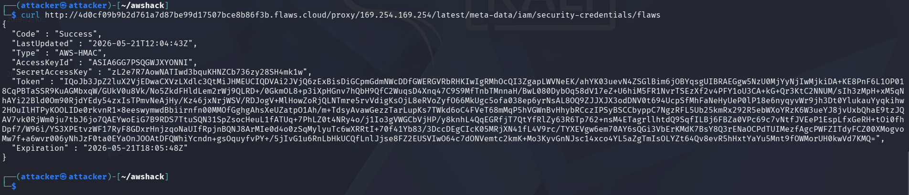

The response returned a complete set of temporary AWS credentials for
the `flaws` IAM role: an `AccessKeyId` beginning with `ASIA`, a
`SecretAccessKey`, and a `Token` (session token). These credentials were temporary,
valid until `2026-05-21T18:05:48Z` when they expire.

I configured a new profile `user2` with these three values, adding the
session token manually to `~/.aws/credentials`. With these credentials
I listed the Level 6 bucket:

```bash
aws --profile user2 s3 ls \
  level6-cc4c404a8a8b876167f5e70a7d8c9880.flaws.cloud
```

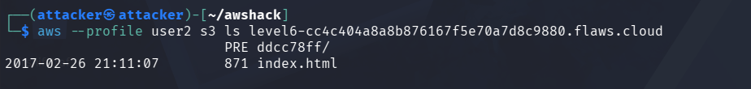

The bucket listing returned a subdirectory `ddcc78ff/` and `index.html`.
Navigating to the Level 6 bucket URL with the `ddcc78ff/` path revealed
the credentials and URL for Level 6.

**Why it works:** `169.254.169.254` is a link-local address. It is only
reachable from within the cloud instance itself, not from the public
internet. However, when an application on that instance fetches
attacker-controlled URLs without restriction, the attacker can instruct
the server to fetch the IMDS address on their behalf. The IMDS cannot
distinguish between the application legitimately requesting its own
credentials and an attacker reaching it via SSRF. This same attack
technique was used in the 2019 Capital One breach, where over 100
million customer records were exposed.

**The fix:** Block access to `169.254.169.254` from any application that
processes user-supplied URLs using firewall rules or application-level
URL validation. Enforce IMDSv2 (Instance Metadata Service version 2),
which requires a session token obtained via a PUT request before
credentials can be retrieved. This is a step that SSRF via GET requests cannot
complete. Audit any proxy or URL-fetching functionality for SSRF
exposure before deploying to cloud infrastructure.

---

## Level 6: Overly Permissive IAM Policy Enables Full Environment Enumeration

**Vulnerability:** The Level 6 IAM user was granted two policies:
`MySecurityAudit` - A highly permissive read-only policy covering most AWS services and 
`list_apigateways` - grants API Gateway enumeration. 
Together these policies allowed full enumeration of Lambda
functions, IAM policies, and API Gateway endpoints, ultimately enabling
the invocation of a restricted Lambda function.

**What I did:**

Using Level 6 credentials obtained from the previous level, I configured
a new profile `user3` and identified the IAM username:

```bash
aws configure --profile user3
aws --profile user3 iam get-user
```

The response confirmed the username is `Level6` under account
`975426262029`. I then listed attached policies:

```bash
aws --profile user3 iam list-attached-user-policies --user-name Level6
```

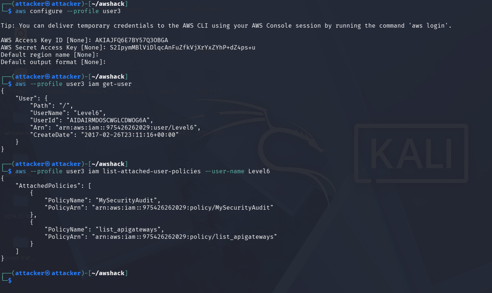

Two policies were attached: `MySecurityAudit` and `list_apigateways`.
The SecurityAudit policy allows reading Lambda function configurations,
so I listed available functions:

```bash
aws --region us-west-2 --profile user3 lambda list-functions
```

A function named `Level6` was returned. I retrieved its resource policy
to understand how it could be invoked:

```bash
aws --region us-west-2 --profile user3 \
  lambda get-policy --function-name Level6
```

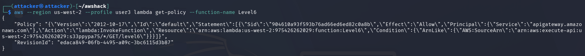

The policy showed the function could be invoked through API Gateway
using the ARN `arn:aws:execute-api:us-west-2:975426262029:s33ppypa75/*/GET/level6`.
The REST API ID is `s33ppypa75`. I retrieved the deployment stage name:

```bash
aws --profile user3 --region us-west-2 \
  apigateway get-stages --rest-api-id "s33ppypa75"
```

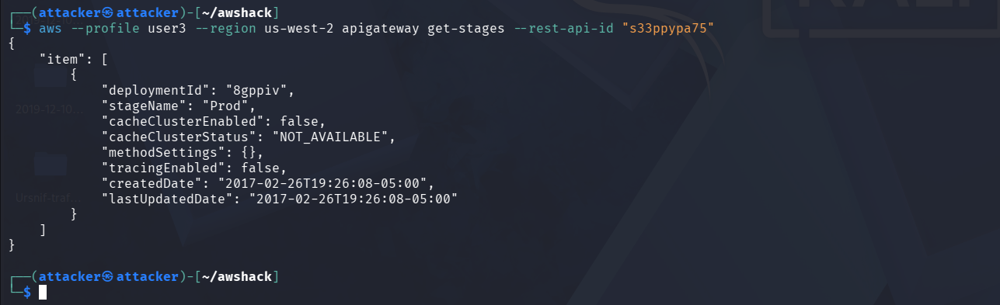

The stage name is `Prod`. Combining the REST API ID, region, stage, and
resource path builds the invocation URL:
`https://s33ppypa75.execute-api.us-west-2.amazonaws.com/Prod/level6`

Navigating to this URL in a browser returned:

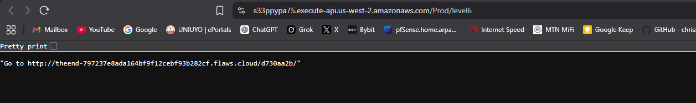

Challenge complete.

**Why it works:** The SecurityAudit policy is designed for security
auditors who need read access to understand the AWS environment. When
granted to a user who should have far more restricted access, it becomes
an enumeration tool. An attacker with SecurityAudit can map the entire
AWS environment - IAM policies, Lambda functions, API Gateway endpoints,
S3 bucket lists, EC2 configurations and identify misconfigurations to
escalate privileges or reach sensitive resources.

**The fix:** Apply the principle of least privilege to every IAM user
and role. A user who only needs to perform one specific task should hold
exactly the permissions required for that task and nothing else. Audit
all IAM policies regularly using AWS IAM Access Analyzer to identify
overly permissive policies. Never attach `SecurityAudit` or similar
broad read policies to service accounts, application users, or any
identity that does not specifically require environment-wide visibility.

---

## Key AWS CLI Commands Reference

These are the commands I used across all 6 levels, a personal reference
for future cloud investigations:

```bash
# Check how a domain is hosted (DNS enumeration)
host TARGET_DOMAIN
nslookup IP_ADDRESS

# List S3 bucket without credentials (public bucket test)
aws s3 ls s3://BUCKET_NAME --no-sign-request --region us-west-2

# Sync entire S3 bucket to local directory
aws s3 sync s3://BUCKET_NAME/ . --no-sign-request --region us-west-2

# Check Git history for leaked credentials
git log
git checkout COMMIT_HASH

# Verify which IAM identity you are using
aws --profile PROFILE sts get-caller-identity

# List policies attached to an IAM user
aws --profile PROFILE iam list-attached-user-policies --user-name USERNAME

# Find EC2 snapshots owned by a specific account
aws --profile PROFILE ec2 describe-snapshots \
  --owner-id ACCOUNT_ID --region us-west-2

# Exploit IMDS via SSRF proxy to steal IAM role credentials
curl http://PROXY_HOST/proxy/169.254.169.254\
/latest/meta-data/iam/security-credentials/ROLE_NAME

# Enumerate Lambda functions
aws --region us-west-2 --profile PROFILE lambda list-functions

# Get Lambda resource policy (shows how it can be invoked)
aws --region us-west-2 --profile PROFILE \
  lambda get-policy --function-name FUNCTION_NAME

# Find API Gateway stage name for Lambda invocation URL
aws --profile PROFILE --region us-west-2 \
  apigateway get-stages --rest-api-id "REST_API_ID"
```

---

## Lessons Learned

1. DNS enumeration is always the first step against any cloud-hosted
   target. A single `host` command confirmed S3 hosting and the region,
   which shaped the entire Level 1 approach before a single AWS command
   was run.

2. Git history is permanent. The Level 3 developer deleted the
   `access_keys.txt` file in a followup commit with the message "Oops,
   accidentally added something I shouldn't have" but `git checkout`
   to the prior commit recovered it in seconds. Any credential committed
   to version control must be treated as permanently compromised,
   regardless of whether it was subsequently deleted.

3. `169.254.169.254` is the most dangerous IP address in cloud
   environments. Any application that fetches user-supplied URLs without
   restriction becomes an SSRF vector to the metadata service. The
   Capital One breach used this exact path. IMDSv2 enforcement closes
   it but only if it is explicitly configured.

4. The words "SecurityAudit" and "read-only" do not mean harmless. A
   policy that can read IAM configurations, Lambda functions, and API
   Gateway endpoints hands an attacker a complete map of the environment.
   Level 6 was completed entirely through read-only API calls. Enumeration
   is an attack and not just reconnaissance.

5. Every level in flaws.cloud was reachable because a resource that
   should have been private was either publicly exposed or accessible
   with credentials obtained from a previous misconfiguration. Cloud
   security failures are rarely isolated rather chained. One public S3
   bucket leads to access keys leads to snapshot enumeration leads to
   credential theft from metadata leads to full environment mapping.

---

## References

- flaws.cloud: [http://flaws.cloud](http://flaws.cloud) by Scott Piper
- Capital One SSRF/IMDS breach analysis:
  [https://krebsonsecurity.com/2019/07/what-we-can-learn-from-the-capital-one-hack/](https://krebsonsecurity.com/2019/07/what-we-can-learn-from-the-capital-one-hack/)
- MITRE ATT&CK techniques referenced:
  - [T1530 — Data from Cloud Storage](https://attack.mitre.org/techniques/T1530/)
  - [T1552.005 — Cloud Instance Metadata API](https://attack.mitre.org/techniques/T1552/005/)
  - [T1078.004 — Valid Accounts: Cloud Accounts](https://attack.mitre.org/techniques/T1078/004/)
  - [T1213 — Data from Information Repositories](https://attack.mitre.org/techniques/T1213/)
  - [T1619 — Cloud Storage Object Discovery](https://attack.mitre.org/techniques/T1619/)
- AWS IMDSv2 documentation:
  [https://docs.aws.amazon.com/AWSEC2/latest/UserGuide/configuring-instance-metadata-service.html](https://docs.aws.amazon.com/AWSEC2/latest/UserGuide/configuring-instance-metadata-service.html)