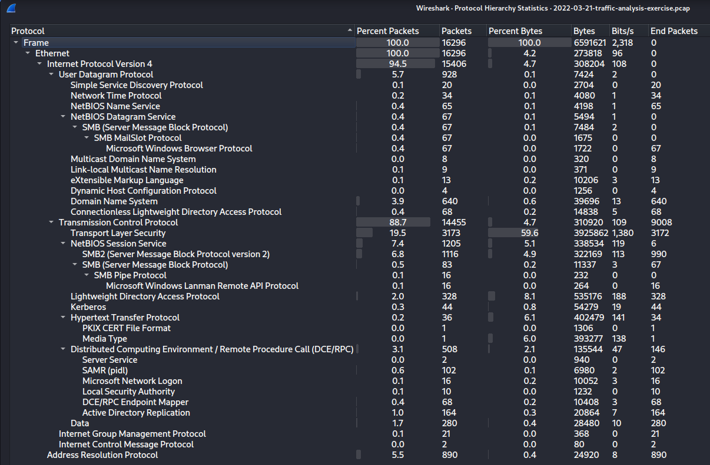
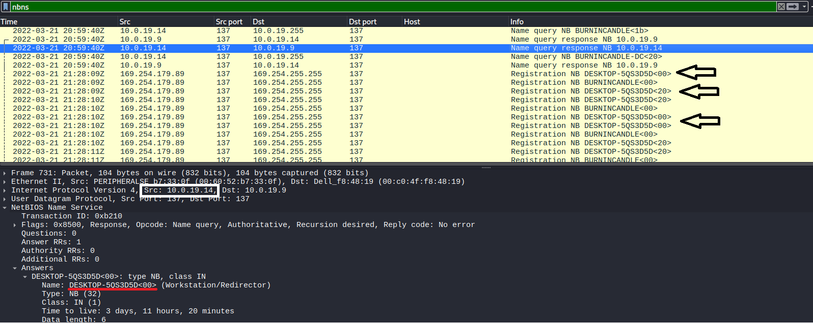
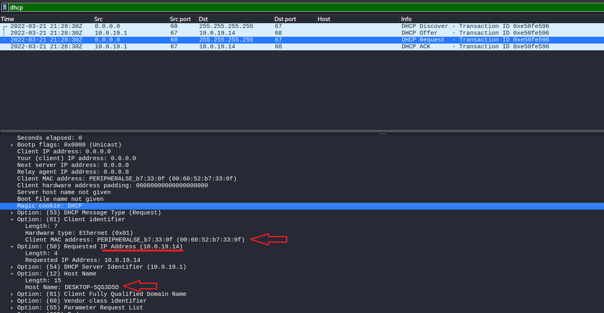
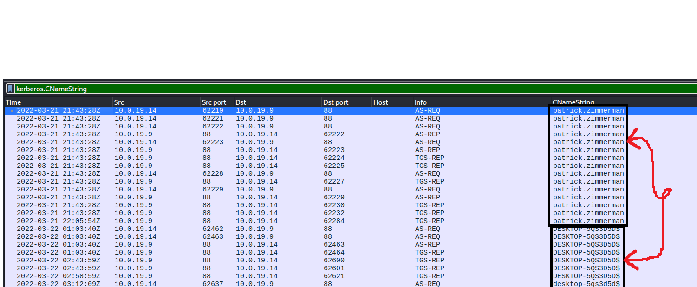
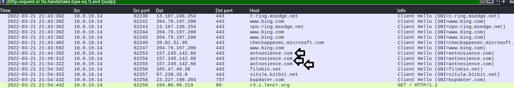
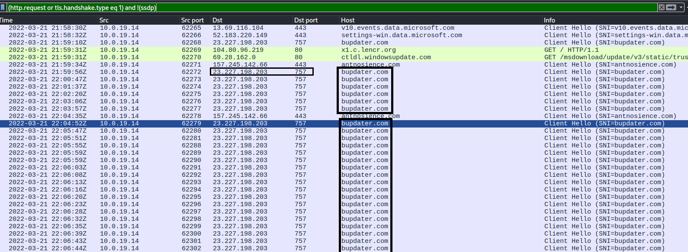

# IcedID (Bokbot) Banking malware PCAP Analysis

| Field | Value |
|---|---|
| Date | 18-05-2026 |
| Platform | Malware Traffic Analysis |
| Category | PCAP Analysis |
| Difficulty | Easy |
| ATT&CK TTPs | T1566.001 · T1204.002 · T1071.001 · T1571 · T1219 · T1082 · T1041 |
| Tools Used | Wireshark · VirusTotal |
| Time Spent | 1 hour 5 minutes |

---

## Executive Summary
A Windows host used by Patrick Zimmerman was infected with IcedID malware. The malware communicated with multiple suspicious C2 domains that let to Cobalt Strike. Two suspicious file-sharing domain activities by the malware was also observed, indicating potential exfiltration.

---

## Artifacts / Environment
**Files provided:**
- `2022-03-21-traffic-analysis-exercise.pcap` - 6.5MB

**Environment:**
- LAN segment: `10.0.19.0/24`
- Domain: `burnincandle.com`
- Domain Controller: `10.0.19.9 — BURNINCANDLE-DC`
- Gateway: `10.0.19.1`

**Victim identified:**
- Hostname: DESKTOP-5QS3D5D
- IP address: 10.0.19.14
- MAC address: 00:60:52:b7:33:0f
- Windows user account: patrick.zimmerman

---

## Scope

**Investigation questions:**
1. What Windows host was infected (hostname, IP, MAC address, user account)?
2. What malware family or families are responsible?
3. What was the infection chain — initial access through to post-infection C2?
4. What are all indicators of compromise from the traffic (IP addresses, domains, URLs aasociated with the activity)?

**Initial hypotheses:**
- Hypothesis 1: A host on the 10.0.19.0/24 segment was compromised and is beaconing to an external C2 server over encrypted traffic.
- Hypothesis 2: Given that this is a 2022 sample, traffic(s) to a C2 will likely be TLS-encrypted and possibly on a non-standard port to evade basic port-based filtering.

---

## Investigation

### Step 1 — Initial Triage (Protocol Hierarchy)

Why:

Before applying any filters, I needed a top-level map of what protocols are present to determine what kind of infection this is and where to focus first.

Action:

```Statistics → Protocol Hierarchy```



Interpretation:

TCP high traffic was expected which indicated possible persistent TCP sessions for C2 beaconing. TLS showed encrypted outbound traffic that could not be read in plaintext, this immediately suggested C2 channel(s) would be inside TLS or a proprietary TCP protocol rather than plain HTTP.

DHCP was present, confirming I could identify the victim via
DHCP hostname. Kerberos and LDAP confirmed a domain-joined Active Directory environment, making both filters reliable
for victim identification.

---

### Step 2 — Victim Host Identified via NBNS and DHCP

Why: 

Establishing the victim's identity (hostname, IP address, MAC address) is always the first active step before looking at any suspicious traffic. NBNS and DHCP contain this information in plaintext.

Filter used:

```nbns``` or 
```dhcp```



Findings:

- NBNS: hostname DESKTOP-5QS3D5D confirmed at 10.0.19.14
- DHCP: MAC address 00:60:52:b7:33:0f confirmed from DHCP Request packet
- Domain controller identified at 10.0.19.9 (BURNINCANDLE-DC)



---

### Finding: Windows Username via Kerberos

Why I ran this:

DHCP and NBNS gave hostname and IP but not the Windows username. In an Active Directory environment, Kerberos authentication traffic carries the username in the CNameString field.

Filter used:

```kerberos.CNameString```



Findings:

- CNameString: `patrick.zimmerman` confirmed as the logged-in user

Interpretation:

Multiple AS-REQ and TGS-REP exchanges between 10.0.19.14 and the domain controller (10.0.19.9) on port 88. All exchanges carry `patrick.zimmerman` as the authenticating principal, anchoring the username to the victim host.

---

### Finding: IcedID C2 Traffic — Suspicious HTTPS Domains

Why:

With the victim identified, I applied the standard TLS handshake filter to identify all encrypted outbound connections from the infected host. The goal was to separate legitimate Microsoft/CDN traffic from suspicious external domains.

Filter used:

```(http.request or tls.handshake.type eq 1) and !(ssdp)```



What I found:

Six domains consistent with the IcedID C2 infection showed low-reputation, recently registered .top and .com domains resolving to two shared IPs (157.245.142.66 and 91.193.16.181), all on port 443:

- `oceriesfornet.top` → 188.166.154.118 (HTTPS GET /)
- `antnosience.com` → 157.245.142.66 (HTTPS)
- `suncoastpinball.com` → 160.153.32.99 (HTTPS)
- `seasksafe.com` → 91.193.16.181 (HTTPS)
- `otectagain.top` → 157.245.142.66 (HTTPS)
- `dilimoretast.com` → 91.193.16.181 (HTTPS)

Interpretation:

Multiple IcedID C2 domains sharing the same backend IPs is a known characteristic of IcedID infection. The malware rotates through
several domains to maintain C2 connectivity if one is blocked.

---

### Finding: Cobalt Strike Beacon on Non-Standard Port 757

Why:

After identifying IcedID activity, I continued examining the TLS
filter output and noticed repeated connections to `bupdater.com` on port
757, a non-standard port that immediately stood out as anomalous. This
pattern of high-frequency connections to a single domain on an unusual
port is characteristic of Cobalt Strike C2 beaconing.

Filter used:

```(http.request or tls.handshake.type eq 1) and !(ssdp)```



What I found:


- `bupdater.com` → 23.227.198.203 — repeated TLS Client Hello on port 757
- Connections begin at 21:54:43Z and repeat continuously at regular intervals

Interpretation:

I found out that Cobalt Strike commonly operates on non-standard ports to evade firewall rules that only inspect ports 80 and 443. Port 757 is not assigned to any legitimate service. 
The regular TLS handshakes to the same IP on the same non-standard port showed beaconing.

---

### Finding: Suspicious File-Sharing Domain Activity

Why: 

Two other domains appeared in the TLS filter output that did not match IcedID or Cobalt Strike C2 patterns but were suspicious, these were used for file sharing. I found this as an exfiltration indicator.

What I found:

- `filebin.net` → 185.47.40.36 — port 443 HTTPS
- `situla.bitbit.net` → 87.238.33.8 — port 443 HTTPS

Interpretation:

Both domains were found out to be legitimate file-sharing services that were used for payload data exfiltration.
---

## Timeline of Events

| Timestamp (UTC) | Event | Source | ATT&CK TTP |
|---|---|---|---|
| 2022-03-21 20:59:40 | NBNS queries (URNINCANDLE domain activity begins) | PCAP | — |
| 2022-03-21 21:28:30 | DHCP lease assigned to DESKTOP-5QS3D5D (10.0.19.14) | PCAP | — |
| 2022-03-21 21:43:28 | Kerberos AS-REQ — patrick.zimmerman authenticates  | PCAP | — |
| 2022-03-21 21:43:30 | TLS connections begin to external hosts | PCAP | T1071.001 |
| 2022-03-21 21:44:30 | First IcedID C2 — antnosience.com:443 | PCAP | T1071.001 |
| 2022-03-21 21:54:34 | Connection to filebin.net (file sharing activity) | PCAP | T1041 |
| 2022-03-21 21:54:35 | Connection to situla.bitbit.net (file sharing) | PCAP | T1041 |
| 2022-03-21 21:54:43 | First Cobalt Strike beacon (bupdater.com:757) | PCAP | T1571·T1219 |
| 2022-03-21 21:54:43 | Cobalt Strike beaconing continues at regular intervals | PCAP | T1219 |

---

## Indicators of Compromise (IoCs)

| Type | Value | Context |
|---|---|---|
| Domain | oceriesfornet.top | 188.166.154.118 (port 80) — HTTP GET / |
| Domain | antnosience.com | 157.245.142.66 (port 443) — HTTP |
| Domain | suncoastpinball.com | 160.153.32.99 (port 443) — HTTPS |
| Domain | seasksafe.com | 91.193.16.181 (port 443) — HTTPS |
| Domain | otectagain.top | 157.245.142.66 (port 443) — HTTPS |
| Domain | dilimoretast.com | 91.193.16.181 (port 443) — HTTPS |
| Domain | bupdater.com | 23.227.198.203 (port 757) — HTTPS |
| Domain | filebin.net | Suspicious file sharing |
| Domain  | situla.bitbit.net | Suspicious file sharing |

---

## ATT&CK Mapping

| Tactic | Technique ID | Technique Name | Observed Behaviour |
|---|---|---|---|
| Initial Access | T1566.001 | Phishing (Spearphishing Attachment) | IcedID delivered via malicious email attachment |
| Execution | T1204.002 | User Execution (Malicious File) | Victim executed the IcedID payload |
| C&C | T1071.001 | Application Layer Protocol (Web) | IcedID C2 over HTTPS to six rotating domains |
| C&C | T1571 | Non-Standard Port | Cobalt Strike beaconing on TCP port 757 |
| C&C | T1219 | Remote Access Software | Cobalt Strike deployed as second-stage RAT |
| Collection | T1041 | Exfiltration Over C2 Channel | filebin.net and situla.bitbit.net (potential staging) |
| Discovery       | T1082 | System Information Discovery | Cobalt Strike collects host information post-deployment |

---

## Lessons Learned

1. This investigation took 1 hour 5 minutes compared to the previous PCAP. The Protocol Hierarchy and victim identification steps are becoming faster because the methodology is now a reflex rather than a decision.

2. IcedID rotates through multiple C2 domains sharing the same backend IP, two domains pointing to 157.245.142.66 and two to 91.193.16.181. When multiple suspicious domains resolve to the same IP, that shared infrastructure is itself a high indicator.

3. Cobalt Strike's non-standard port 757 made it immediately visible in the TLS filter output, it stood out from all other port 443 traffic without requiring any additional filter. Any repeated TLS connections on a port outside 80 and 443 should be treated as a priority finding.

4. File-sharing domains (filebin.net, situla.bitbit.net) appearing after C2 establishment is a pattern worth remembering, legitimate file-sharing services are commonly abused for payload staging and exfiltration because they carry positive domain reputation that bypass basic blocklists.