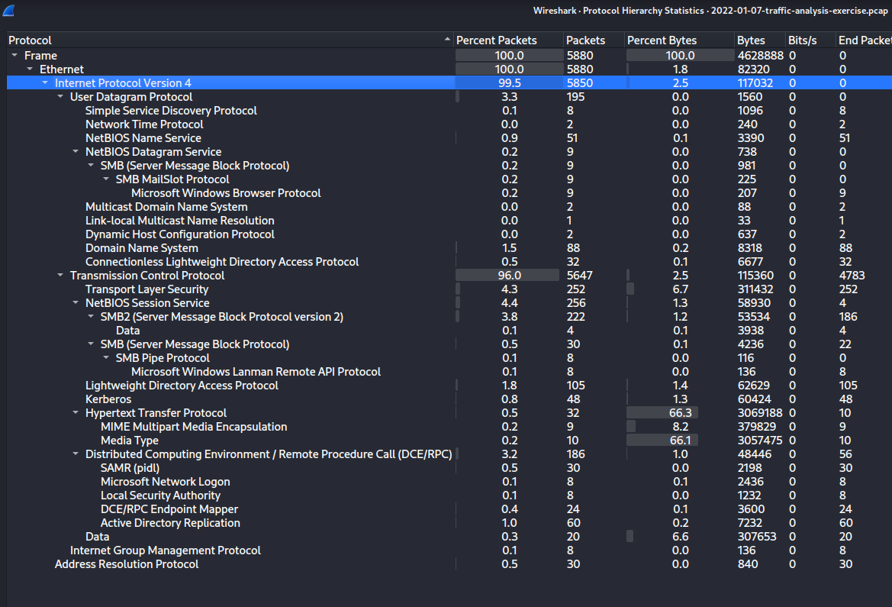
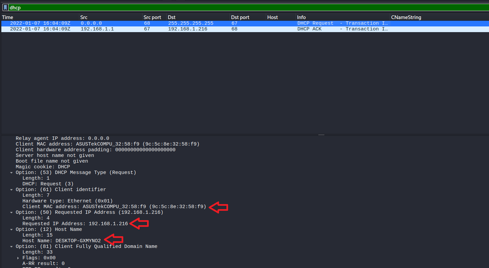
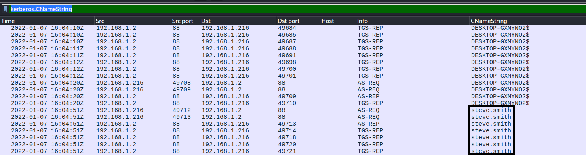
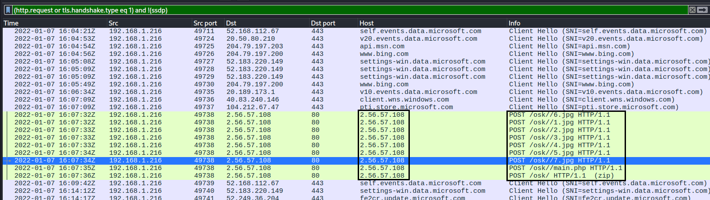
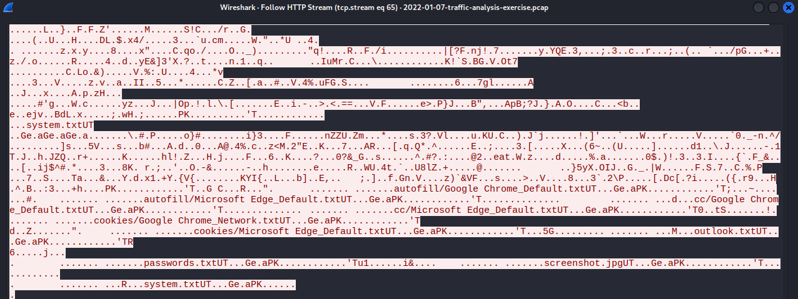

# OskiStealer Malware PCAP Analysis — Spoonwatch

| Field | Value |
|---|---|
| Date | 18-05-2026 |
| Platform | Malware Traffic Analysis |
| Category | PCAP Analysis |
| Difficulty | Easy |
| ATT&CK TTPs | T1566.001 · T1105 · T1036.005 · T1005 · T1552.001 · T1539 · T1113 · T1041 |
| Tools Used | Wireshark · VirusTotal · bazaar.abuse.ch |
| Time Spent | 55 minutes |

---

## Executive Summary

A Windows host used by Steve Smith was infected with OskiStealer malware. The malware stole data (browser credentials, cookies, autofill data, passwords). It compressed all collected data into a zip archive and exfiltrated to a C2 server it had already established connection.

---

## Artifacts / Environment

**Files provided:**
- `2022-01-07-traffic-analysis-exercise.pcap` - 4.5MB

**Environment:**
- LAN segment: `192.168.1.0/24`
- Domain: `spoonwatch.net`
- Domain Controller: `192.168.1.9 — SPOONWATCH-DC`
- Gateway: `192.168.1.1`

**Victim identified:**
- Hostname: DESKTOP-GXMYNO2
- IP address: 192.168.1.216
- MAC address: 9c:5c:8e:32:58:f9
- Windows user account: steve.smith

---

## Scope

**Investigation questions:**
1. What Windows host was infected (hostname, IP, MAC, user account)?
2. What malware family is responsible and what did it do?
3. What data was stolen and how was it exfiltrated?
4. What are all indicators of compromise (IP addresses, domains, URLs aasociated with the activity)?

**Initial hypotheses**
- Hypothesis 1: A host on the 192.168.1.0/24 segment was compromised and is exfiltrating data to an external server.
- Hypothesis 2: Given this is a malware that steals data, the exfiltration traffic may be visible in plaintext HTTP rather than encrypted HTTPS because they often prioritise speed over evasion.

---

## Investigation

### Step 1 — Initial Triage (Protocol Hierarchy)

Why: 

Before applying any filters, I needed a top-level map of all protocols present to understand the character of this infection before examining individual packets.

Action:

```Statistics → Protocol Hierarchy```



Interpretation:

TLS is present but low. This confirmed that the primary malicious activity could possibly be visible in plaintext, not encrypted.

Kerberos and LDAP confirm a domain-joined environment, making them reliable in identifying the Windows username.

---

### Step 2 — Victim Host Identified via DHCP

Why: 

To help establish hostname, IP, and MAC address before looking at any
suspicious traffic.

Filter used:

```dhcp```



Findings:

- Hostname: DESKTOP-GXMYNO2
- IP address: 192.168.1.216 (confirmed in DHCP Request from 192.168.1.1)
- MAC address: 9c:5c:8e:32:58:f9 (ASUSTekCOMPU_32:58:f9)

---

### Finding: Windows Username via Kerberos

Why:

DHCP provided the hostname and IP address but not the Windows username. In a domain environment, Kerberos authentication carries the username in the CNameString field.

Filter used:

```kerberos.CNameString```



Findings:

- CNameString: `steve.smith` confirmed across multiple AS-REQ and
TGS-REP exchanges between 192.168.1.216 and the DC (192.168.1.2)
beginning at 16:04:51Z

Interpretation:

Initial Kerberos traffic at 16:04:10Z shows DESKTOP-GXMYNO2$ (the
host) authenticating as a normal domain activity. From 16:04:51Z, `steve.smith` appears in AS-REQ packets, indicating the user logged in and began authenticating to domain services.

---

### Finding: DLL Components Downloaded Disguised as .jpg Files

Why:

I applied the standard TLS/HTTP filter and immediately identified a cluster of POST requests to an IP with no hostname.

Filter used:

```(http.request or tls.handshake.type eq 1) and !(ssdp)```



What I found:

Seven sequential HTTP POST requests to 2.56.57.108:80 beginning at 16:07:32Z, each retrieving a file with a .jpg extension via paths under `/osk/`:

- `POST /osk/6.jpg` — sqlite3.dll (632KB)
- `POST /osk/1.jpg` — freebl3.dll (328KB)
- `POST /osk/2.jpg` — mozglue.dll (136KB)
- `POST /osk/3.jpg` — msvcp140.dll (432KB)
- `POST /osk/4.jpg` — nss3.dll (1220KB)
- `POST /osk/5.jpg` — softokn3.dll (144KB)
- `POST /osk/7.jpg` — vcruntime140.dll (84KB)
- `POST /osk/main.php` — OskiStealer executable
- `POST /osk/` (zip) — final exfiltration archive

Interpretation:

None of the seven DLL files were malicious in themselves. 
OskiStealer requires them to parse browser storage formats to steal data. These were disguised as .jpg files (T1036.005 on the ATT&CK Mitre) is a deliberate evasion technique to bypass file type inspection at the network perimeter.

---

### Finding: Stolen Data Exfiltrated via Final HTTP POST (zip)

Why:

The final `POST /osk/` request marked as a _.zip_ in represented the culmination of the infection — the actual exfiltration of harvested data. I followed the TCP stream to examine its contents.

Action:

```Right-click POST /osk/ → Follow → TCP Stream```



What I found in the stream:

The _.zip_ archive contained the following stolen files, visible as filenames in the multipart stream data:

- `autofill/Google Chrome_Default.txtUT` — Chrome autofill data
- `autofill/Microsoft Edge_Default.txtUT` — Edge autofill data
- `cookies/Google Chrome_Network.txtUT` — Chrome cookies
- `cookies/Microsoft Edge_Default.txtUT` — Edge cookies
- `passwords.txtUT` — plaintext saved passwords
- `screenshot.jpgUT` — screen capture taken at time of infection
- `system.txtUT` — system information

Interpretation:

OskiStealer exfiltrated credentials, session cookies, and autofill data from broswers on the Windows host.
All of this transmitted in plaintext HTTP, the entire contents of the exfiltration are visible to any network monitor, including this PCAP analysis.

---

## Timeline of Events

| Timestamp (UTC) | Event | Source | ATT&CK TTP |
|---|---|---|---|
| 2022-01-07 16:04:09 | DHCP Request/ACK — victim IP assigned | PCAP | — |
| 2022-01-07 16:04:10 | Kerberos — DESKTOP-GXMYNO2$ machine auth begins | PCAP | — |
| 2022-01-07 16:04:51 | Kerberos AS-REQ (steve.smith user login) | PCAP | — |
| 2022-01-07 16:07:32 | POST /osk/6.jpg — sqlite3.dll downloaded | PCAP | T1105·T1036.005 |
| 2022-01-07 16:07:32 | POST /osk/1.jpg through /osk/7.jpg — 6 more DLLs  | PCAP | T1105·T1036.005 |
| 2022-01-07 16:07:34 | POST /osk/main.php — OskiStealer binary delivered  | PCAP | T1105 |
| 2022-01-07 16:07:35 | OskiStealer harvests browser credentials, cookies, screenshot | Host | T1005·T1552.001·T1539·T1113 |
| 2022-01-07 16:07:36 | POST /osk/ (zip) — stolen data exfiltrated | PCAP | T1041 |

---

## Indicators of Compromise (IoCs)

| Type | Value | Context |
|---|---|---|
| IP | 2.56.57.108 | port 80 POST /osk//1.jpg HTTP/1.1 |
| IP | 2.56.57.108 | port 80 POST /osk//2.jpg HTTP/1.1 |
| IP | 2.56.57.108 | port 80 POST /osk//3.jpg HTTP/1.1 |
| IP | 2.56.57.108 | port 80 POST /osk//4.jpg HTTP/1.1 |
| IP | 2.56.57.108 | port 80 POST /osk//5.jpg HTTP/1.1 |
| IP | 2.56.57.108 | port 80 POST /osk//6.jpg HTTP/1.1 |
| IP | 2.56.57.108 | port 80 POST /osk//7.jpg HTTP/1.1 |
| IP | 2.56.57.108 | port 80 POST /osk//main.php HTTP/1.1 |
| IP | 2.56.57.108 | port 80 POST  /osk/ HTTP/1.1 (zip) |
| SHA256 | 16574f51785b0e2fc29c2c61477eb47bb39f714829999511dc8952b43ab17660 | sqlite3.dll — 1.jpg (632KB) |
| SHA256 | a770ecba3b08bbabd0a567fc978e50615f8b346709f8eb3cfacf3faab24090ba | freebl3.dll — 2.jpg (328KB) |
| SHA256 | 3fe6b1c54b8cf28f571e0c5d6636b4069a8ab00b4f11dd842cfec00691d0c9cd | mozglue.dll — 3.jpg (136KB) |
| SHA256 | 334e69ac9367f708ce601a6f490ff227d6c20636da5222f148b25831d22e13d4 | msvcp140.dll — 4.jpg (432KB) |
| SHA256 | e2935b5b28550d47dc971f456d6961f20d1633b4892998750140e0eaa9ae9d78 | nss3.dll — 5.jpg (1220KB) |
| SHA256 | 43536adef2ddcc811c28d35fa6ce3031029a2424ad393989db36169ff2995083 | softokn3.dll — 6.jpg (144KB) |
| SHA256 | c40bb03199a2054dabfc7a8e01d6098e91de7193619effbd0f142a7bf031c14d | vcruntime140.dll — 7.jpg (84KB) |

---

## ATT&CK Mapping

| Tactic | Technique ID | Technique Name | Observed Behaviour |
|---|---|---|---|
| Initial Access | T1566.001 | Phishing: Spearphishing Attachment | OskiStealer delivered via malicious email attachment |
| C&C | T1105 | Ingress Tool Transfer | 7 DLL components downloaded from C2 disguised as .jpg files |
| Defense Evasion | T1036.005 | Masquerading: Match Legitimate Name | Legitimate DLLs renamed with .jpg extension to evade inspection |
| Collection | T1005 | Data from Local System | Browser databases read from local filesystem |
| Credential Access | T1552.001 | Unsecured Credentials: Credentials in Files | Saved passwords harvested from Chrome and Edge |
| Credential Access | T1539 | Steal Web Session Cookie | Browser session cookies harvested from Chrome and Edge |
| Collection | T1113 | Screen Capture | Screenshot taken at infection time, included in exfil zip |
| Exfiltration | T1041 | Exfiltration Over C2 Channel | Stolen data compressed and POSTed to C2 over plain HTTP |

---

## Lessons Learned

1. The analysis methodology used is becoming a reflex. Protocol Hierarchy → DHCP/NBNS → Kerberos → HTTP/TLS filter → follow streams. Each step now executes without deliberation.

2. OskiStealer operates entirely over plaintext HTTP using no TLS encryption. Not all modern malware uses HTTPS. Some stealers deliberately avoid TLS because encryption adds overhead and they move fast, the entire infection of this one, download, harvest, and exfiltration cycle completed in under 4 minutes.

3. Disguising DLLs as .jpg files (T1036.005) defeats file-type-based network controls but not content inspection. The HTTP stream reveals the PE32 executable headers regardless of the .jpg filename. Any .jpg file arriving over HTTP with a POST method and a PE32 header in the response is malicious file extension and actual file type must always be verified independently.

4. The entire exfiltration archive was readable in plaintext from the TCP stream, the passwords, cookies, autofill data all visible. This demonstrates that unencrypted C2 channels are catastrophic for the attacker's operational security but offer significant visibility to defenders.